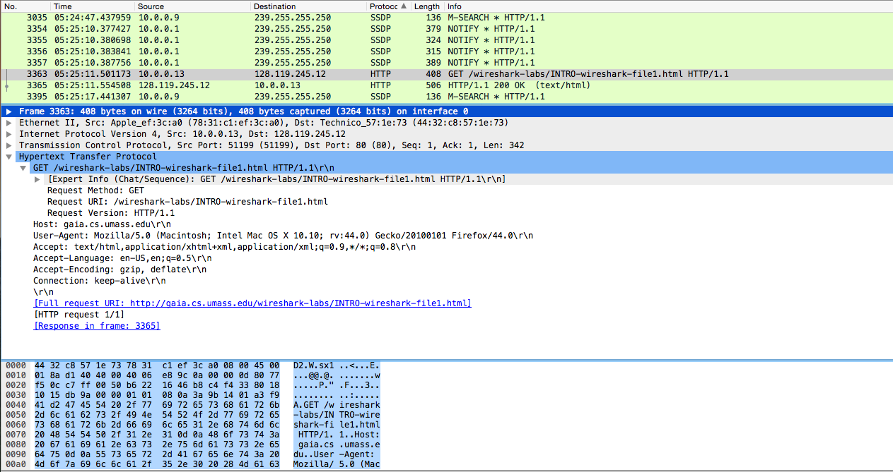

# Wireshark Lab #
### Part I ###

Capturing http://gaia.cs.umass.edu/wireshark-labs/INTRO-wireshark-file1.html packet

1) 3 protocols: Hyper Text Transfer Protocol (HTTP), Online Certificate Status Protocol (OCSP) and Simple Service Discovery Protocol (SSDP)

2) $.554508 - .501173 = .53335$ seconds
3) gaia.cs.umass.edu IP: 128.119.245.12
my IP: 10.0.0.13

### Part II ###
