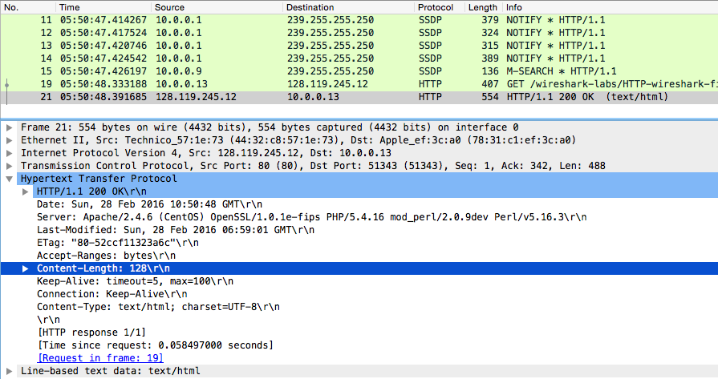
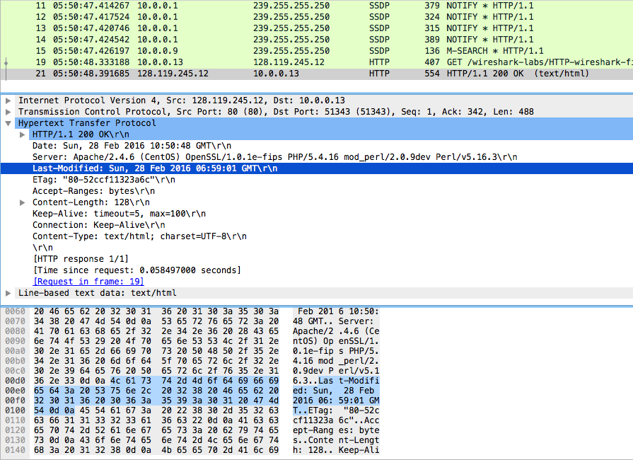
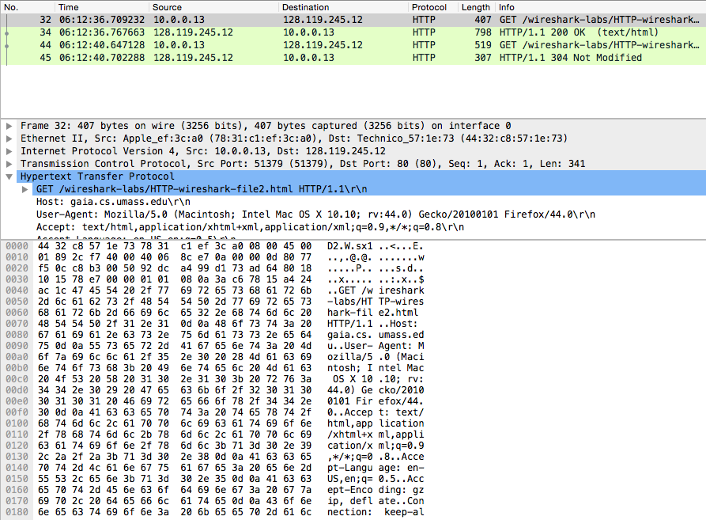
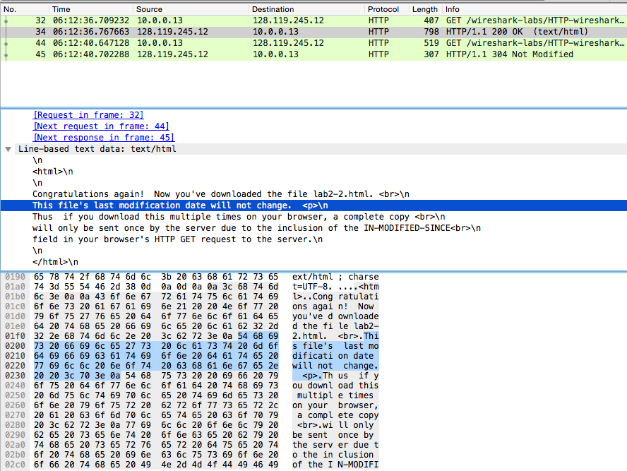
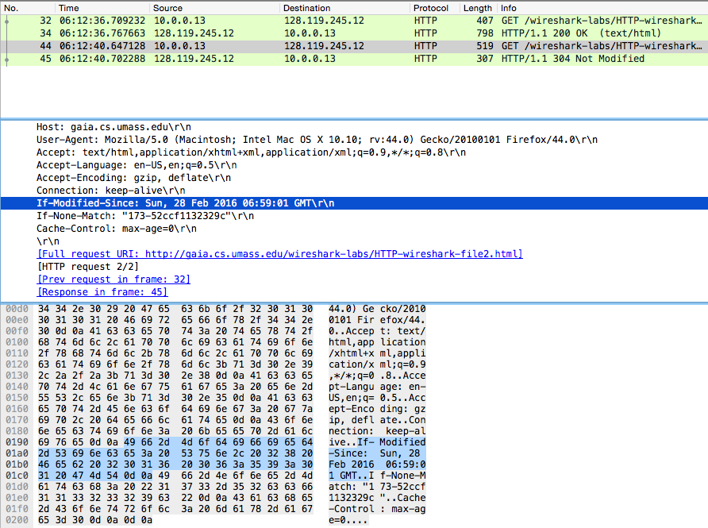
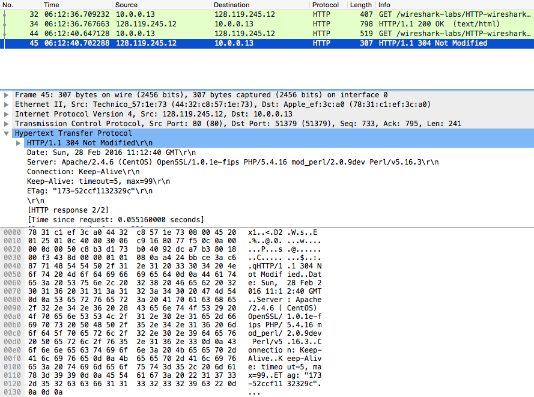
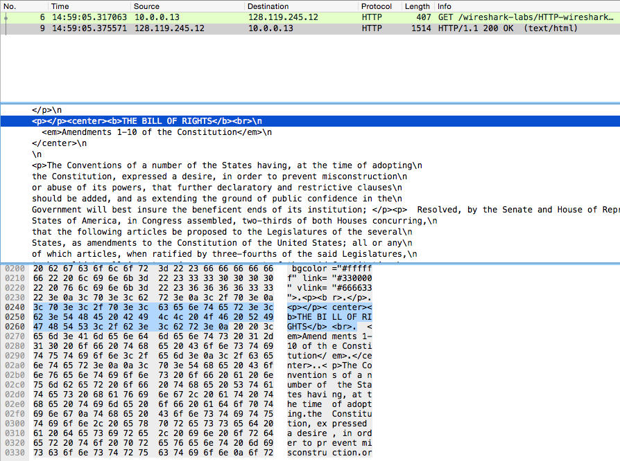
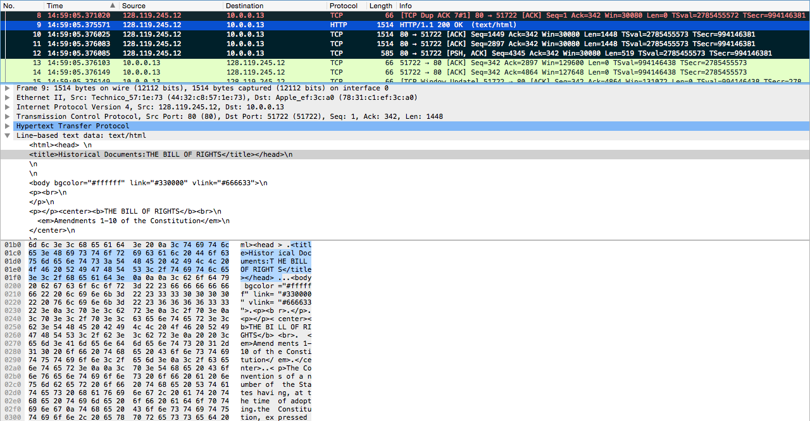
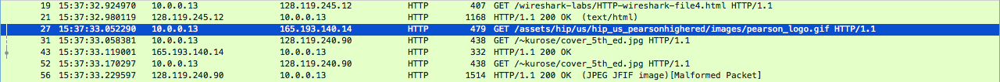
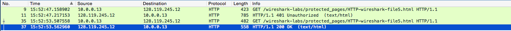

# Wireshark Lab #
#### lukas_borges ###
### Part I ###

Capturing http://gaia.cs.umass.edu/wireshark-labs/INTRO-wireshark-file1.html packet

1) 3 protocols: Hyper Text Transfer Protocol (HTTP), Online Certificate Status Protocol (OCSP) and Simple Service Discovery Protocol (SSDP)

2) $.554508 - .501173 = .53335$ seconds
3) gaia.cs.umass.edu IP: `128.119.245.12`
my IP: `10.0.0.13`

---
### Part II ###
#### 1. The basic HTTP GET/response interaction ####

1) HTTP 1.1
2) No language specification (Accept-language or 'en') on header
3) My browser: `10.0.0.3`
Gaia: `128.119.245.12`
4) `200 OK`
5) Last-Modified: `Sun, 28 Feb 2016 06:59:01 GMT`
6) Content-length: `128 bytes`
7) No extra headers

_Content-Length:_

_Last-modified:_

#### 2. HTTP Conditional GET/response interaction:
8) No `if-modified-since`:

9) Yes, the HTML code displayed on browser is present:

10) Yes: `Sun, 28 Feb 2016 06:59:01 GMT`

11) The response was a `304 Not Modified`

This happened because the file inside the server remains unchanged in comparison to the file cached. There is no need for of another costly round-trip-time to send me something I already have.

#### 3. Retrieving Long Documents ####

12) One `HTTP GET`

13) Packet number 9

14) `HTTP/1.1 200 OK`

15) Data is reassembled between packets 9 through 12. 4 TCP segments total.

#### 4. HTML Documents with Embedded Objects ####

16) 4 `HTTP GET` request messages to:
- `wireshark-labs/HTTP-wireshark-file.4html`
- `/assets/hip/us/hip_us_pearsonhighered/images/pearson_logo.gif`
- `/~kurose/cover_5th_ed.jpg`
- `/~kurose/cover_5th_ed.jpg`

17) Browser behavior gives it away since the top image loaded before the bottom image. There is no GET message requesting two images at the same time. One GET request for each image and they are satisfied serially.

#### 5. HTTP Authentication ####

18) `401 Unauthorized`

19) `200 OK`
