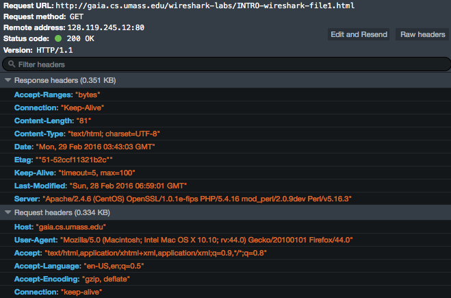
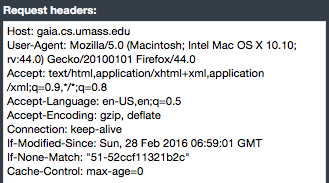
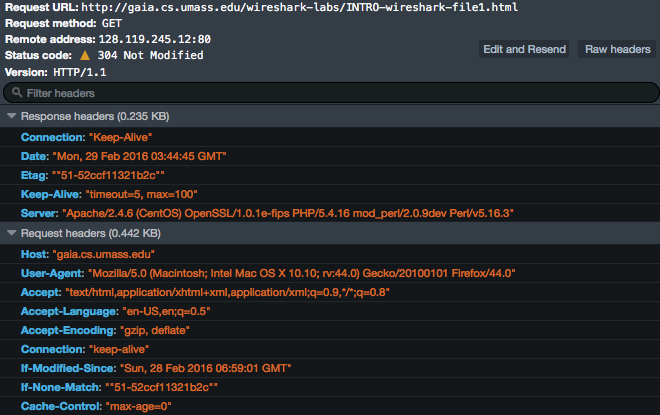
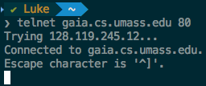
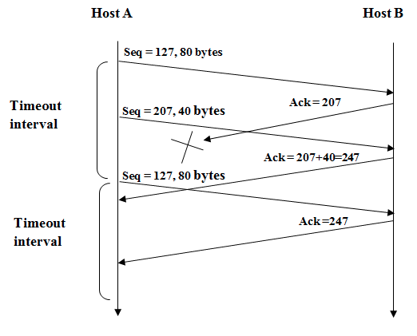

# Homework questions #
#### lukas_borges ####
Chapter 2 Review questions: R1, R4, R11, R14, R25
Chapter 2 Problems: P1, P4, P5, P10, P11, P14, P15

Chapter 3 Review questions: R1, R2, R14, R15, R17
Chapter 3 Problems: P1, P3, P26, P27, P31, P40

### Chapter 2: ###
#### Review questions: ####
R1.
|#|application|protocol|
|:-:|:-:|:-:|
|1|email|SMTP (simple mail transfer protocol)|
|2|file transfer|FTP (file transfer protocol)|
|3|web|HTTP (hyper text transfer protocol)|
|4|remote login|telnet|
|5|streaming services|RTP (real-time transport protocol)|

R4.
What happens in P2P is that every user is a client and a server at the same time. There is still a client-server relationship, but it is interchangeable.

R11.
HTTP, FTP, SMTP and POP3 all require reliable data transfer. TCP provides schemes for data loss and corruption, while UDP works with a best-effort policy. Basic implementations of UDP do not guarantee information integrity, so important for the listed protocols.

R14.
_telnet was not working as I expected, so I used Firefox developer tools instead:_
first request

after selecting `Edit and Resend`, I manually edited the header:

this is the response:

Works as proposed.

R25.
1. Messaging
2. Real time communication (Skype)
3. File Sharing (torrent)
4. Distributed Computing

#### Problems ####
P1.
  |statement|answer|
  |:-:|:-:|
  |a|False|
  |b|True|
  |c|False|
  |d|False|
  |e|False|

P4.
a. http://gaia.cs.umass.edu/cs453/index.html
b. HTTP/1.1
c. `Connection:keep-alive`, persistent
d.    
`128.119.245.12`
e. Mozilla Firefox. Browser information is needed by the server in order to send different versions of the same object to different types of browsers.

P5.
a. Status code: `200 OK`.
`Date Tue 07 Mar 2008 12:39:45 GMT`
b. `Last-Modified: Sat, 10 Dec 2005 18:27:46 GMT`
c. `Content-Length: 3874` (bytes)
d. `<!doc`. Yes, according to `Connection: Keep-Alive`

P10.
**persistent HTTP:**
total time to receive all objects:
$$\left(\frac{200}{150}+T_p+\frac{200}{150}+T_p+\frac{200}{150}+T_p+\frac{100,000}{150}+T_p\right)+$$

$$\left(\frac{200}{150}+T_p+\frac{200}{150}+T_p+\frac{200}{150}+T_p+\frac{100,000}{150}+T_p \right)$$

$$=\left(\frac{200+200+200+100,000}{150}+4T_p\right)$$$$+\left(\frac{200+200+200+100,000}{15}+4T_p\right)$$

$$=\left(\frac{100,600}{150}+4T_p\right)+\left(\frac{100,600}{15}+4T_p\right)$$$$=(670+4T_p)+(6706+4T_p)$$$$=7377+8*T_p\,seconds$$

time needed:
$$\left(\frac{200}{150}+T_p+\frac{200}{150}+T_p+\frac{200}{150}+T_p+\frac{100,000}{150}+T_p\right)+$$ $$10*\left(\frac{200}{150}+T_p+\frac{100,000}{150}+T_p\right)$$ $$=\left(\frac{200+200+200+100,000}{150}+4T_p\right)+10*\left(\frac{200+100,000}{150}+2T_p\right)$$ $$=\left(\frac{100,600}{150}+4T_p\right)+10*\left(\frac{100,200}{150}+2T_p\right)$$ $$=(670+4T_p)+(6680+20T_p)$$$$=7350+24*T_p$$

propagation speed of the medium: $300*10^6m/sec$

$$T_p=\frac{10}{(300*10^6)}=0.03\,microseconds$$

For this case, persistent HTTP has no significant gain over non-persistent.

P11.
a. Yes. Bob's parallel connections will help him get pages quicker since he is using parallel instance of non-persistent HTTP while the others use non-persistent HTTP with parallel download.
b. Yes, even if all five users open five parallel instances of non-persistent HTTP. If Bob does not use parallel connections, he will get less bandwidth share. At this point, everyone (including Bob) should get equal bandwidth.

P14.
- SMTP uses period [`.`] to indicate end of message body.
- HTTP uses Content-Length header field to indicate end of message body.
HTTP cannot use the same method because there is no format for message body in HTTP.

P15.
MTA: Mail Transfer Agent.
|Mail received from|Mail received by|
|:-:|:-:|
|barmail.cs.umass.edu [128.119.240.3]|cs.umass.edu [8.13.1/8.12.6]|
|asusus-4b96 [localhost (127.0.0.1)]|barmail.cs.umass.edu|
|asusus-4b96 [58.88.21.177]|barmail.cs.umass.edu|
|[58.88.21.177]|lnbnd55.exchangeddd.com|

At `asusus-4b96[58.88.21.177]` the MTA does not report from where it receives the email (dishonest). If the mail is spam, only originator can be dishonest.

`asusus-4b96[58.88.21.177]` is the malicious host that generated spam.

---
### Chapter 3: ###
#### Review questions: ####

R1.
a.
Transport protocol (TP):
- Accept chunk of data, Destination's host address and port number (given by the sender)
- Maximum size of data: 1196 bytes
- Add a 4-byte header to each chunk
- Number of destinations included in header
- Destination host address and resulting segment are passed to the network layer by our TP.
- Network layer delivers segment to TP at destination.
- At destination, port number from segment is analyzed by the TP, which catches the data and sends it to the process with port number accordingly.

b.
Modified TP (mTP):
- Accept chunk of data, Destination's host address and port number (given by the sender)
- Maximum size of data: 1196 bytes
- Segment now has two header fields. One is used to specify source port and another to specify destination port.
- Add two 4-byte headers to each chunk. Include source port number and destination port number in two header fields.
- Destination host address, and resulting segment are passed to the network layer by mTCP
- Network layer delivers segment to mTCP at destination
- At destination, port number in the segment is examined by mTCP, which catches the data and sends it to the process with port number accordingly.
- It also gives the source port number to the application

c. No, transport layer only acts in the end systems.

R2.
a.
- Sender give delegate the letter along with the address of the destination's house and the name of the recipient.
- Delegate writes recipient's name is written on top of the letter.
- Letter is put into an envelope. Destination's house address is written by the delegate.
- Delegate passes letter to the planet's mail service.
- Receiver accepts letter from delegate. Envelope is opened and recipient's name written on top is stored.
- Delegate hand overs the letter according to the family name written on top.

b.
No, there is no need for the mail service to open the envelope and examine address. Envelope is opened by the delegate. Recipient's name written on top is noticed in order to deliver accordingly.

R14.
|statement|answer|
|:-:|:-:|
|a|False|
|b|False|
|c|True|
|d|False|
|e|True|
|f|False|
|g|False|

R15.
a.
first segment `SEQNUM = 90`
second segment `SEQNUM = 110`
data in first segment: $110-90=20\,bytes$

b.
90 is the segment number of the first segment.

R17.
TCP shares Rate $\frac{R}{2}\,bps$ to each TCP connection

#### Problems: ####
P1.
|prompt|connection|source port|destination port|
|:-:|:-:|:-:|:-:|
|a|A $\rightarrow$ S|467|23|
|b|B $\rightarrow$ S|513|23|
|c|S $\rightarrow$ S|23|467|
|d|S $\rightarrow$ B|23|513|

e.
Yes, because IP addresses are also included.

f.
No, the server uses IP addresses to distinguish between hosts.

P3.
_part 1:_
first byte: `0101 0011`
second byte: `0110 0110`
third byte: `0111 0100`

first + second:
`0101 0011`+
`0110 0110`
\___________
`1011 1001` (first sum)

first sum + third byte
`1011 1001` +
`0111 0100`
\___________
wrap around: `(1) 0010 1101` (second sum)
`1`
\___________
Total Sum: `0010 1110`
Checksum: `1101 0001`

1s complement of: `0010 1110 = 1101 0001`
Same as Checksum.

_part 2:_ When the 1's complement of sum is performed, resultant will be the checksum. Receiving host uses the checksum so check for errors.

_part 3:_ At receiving end, all bytes (including checksum) are added. Receiver looks at the checksum to for errors. If the sum contains all 1s, no errors. If there is at least one 0 bit, there is an error.

_part 4:_ All one-bit errors will be detected. Two bit errors can be undetected since they could end up complementing each others' value.

P26.
a.
MSS $= 536$ bytes
TCP sequence number field $ = 4$ bytes

$=4 * 8 = 32\,bits = 2^{32}$
Maximum file size that can be sent is given by how many bytes can be represented by $2^{32}$

$=2^2*2^{30}$ bytes
$=2^2$ Gbytes or $4$ Gbytes

b.
Number of Segments $=\frac{2^{32}}{536}=801299$
Number of bytes in each segment $=66$
Total number of bytes sent over the 155Mbps link $=8012999*66$ bytes
$=528857934$ bytes $= 4.824*10^9$ bytes

time it takes:
$$\frac{4.824*10^9*8\,bits}{155*10^6\,bps}$$$$\approx249 seconds$$

P27.

a.
`SEQNUM` = `SEQNUM` of first segment + number of bytes of data in first segment
$127 + 80 = 207$
Source port: 302
Destination port: 80

b.
Acknowledgement number: 207
Source port: 80
Destination port: 302

c.
Acknowledgement number: 127
Because the receive is waiting for 127 bytes of upcoming data.

d.

Even though ACK 207 is loss, when Host A receives ACK 247, it knows that packet 207 was received.

P31.
- EstimatedRTT $=(1-\alpha)*EstimatedRTT + \alpha*SampleRTT$
- DevRTT = $(1-\beta)*DevRTT+\beta*|SampleRTT-EstimatedRTT|$
- Timeout Interval $=EstimatedRTT+4*DevRTT$

**First sample (106 ms)**:
EstimatedRTT: $0.875*100+0.125*106=100.75$
DevRTT: $0.75*5+0.25*5.25=5.06$
TimeOut Interval: $100.75+4*5.06=120.99$

**Second sample (120 ms)**:
EstimatedRTT: $0.875*100+0.125*120=103.156$
DevRTT: $0.75*5.06+0.25*16.84=8$
TimeOut Interval: $103.156+4*8=135.156$

**Third sample (140 ms)**:
EstimatedRTT: $0.875*103.156+0.125*140=107.761$
DevRTT: $0.75*8+0.25*32.239=14.05$
TimeOut Interval: $107.761+4*14.05=163.961$

**Fourth sample (90 ms)**:
EstimatedRTT: $0.875*107.761+0.125*90=105.54$
DevRTT: $0.75*14.05+0.25*(-15.54)=6.73$
TimeOut Interval: $105.54+4*6.73=132.46$

$Timeout Interval_{90}=132.46$

**SampleRTT (115 ms)**:
EstimatedRTT: $0.875*105.54+0.125*115=106.772$
DevRTT: $0.75*6.73+0.25*|115-106.772|=7.10$
TimeOut Interval: $106.772+4*7.10=135.122$

$Timeout Interval_{115}=135.122$

P40.

a.
[1,6] and [23, 26]

b.
[6,16] and [17,22]

c.
Yes, the segment loss after 16th transmission is indicated by triple-duplicate ACK.

d.
Yes, segment loss after 22nd transmission is indicated by a timeout.

e.
Initial threshold (segment size threshold) value at the first transmission is 32.

f.
Threshold value during 18th transmission is 21.

g.
Threshold value during 24th transmission round is 14 (approx).

h.
|transmission|packet number|
|:-:|:-:|
|1|1|
|2|2 - 3|
|3|4 - 7|
|4|8 - 15|
|5|16 - 31|
|6|32 - 63|
|7|64 - 96|

70th segment is transmitted in the 7th round.

i.
Threshold value after 26th transmission is 4.

j.
Threshold value at 19th transmission is 21 and congestion window size is 1.

k.
Total of 52 packets.

|Transmission Round|Number of Packets|
|:-:|:-:|
|17|1|
|18|2|
|19|4|
|20|8|
|21|16|
|22|21|
|total|52|
