# Homework questions #
#### lukas_borges ####

Chapter 4:

Review Questions R1,R2,R3,R4 (omit the parts of these review questions that refer to virtual circuits since we did not cover it in class), R8, R9, R12, R13, R16, R18, R21, R23, R24, R27

Problems: P7,  P10, P24, P26, P30, P37, P42

### Chapter 4: ###
#### Review questions: ####

**R1.**

Datagram.
Router's forwarding decisions are based on network-layer field value. A switch is a packet switcher whose forwarding decisions are based on the link-layer field value. Also, routers use IP addresses while link-layer switches use MAC addresses.

**R2.**

Forwarding and Routing.

**R3.**

Routing determines the end-to-end paths that packets should take from source to destination (uses routing algorithms).

Forwarding moves the packet that arrives at the input link to the correct output link (uses forwarding tables).

**R4.**

Yes they do.

For Datagram Networks:
- The forwarding tables consist of **header value** or **destination address** and **output link** fields.

Virtual Circuit Networks:
- Forwarding table consists of **incoming interface**, **incoming VC number**, **outgoing interface**, and **outgoing VC numbers** fields.

**R8.**

1. Switching via memory
2. Switching via bus
3. Switching via interconnection network

**Memory:**
Switching of input and output ports are directly controlled by CPU. Packets arrive from input port by fetching the interrupt signal in CPU. Routing processor catches the destination address from header, uses forwarding table to find appropriate output port and then copies the packet to the output port buffer.

**Bus:**
Packets are moved from input to output port directly over a shared bus. Because this bus is shared, only one packet at a time. When a packet arriving at the input port finds the bus busy, it is blocked and queued.

**Interconnection network:**
A crossbar switch is an example of such. A packet arriving at input port travels along the horizontal bus attached to the input port until it intersects with a vertical bus which leads to the appropriate output port. When the vertical bus is free, the packet can be transferred. If not, the packet is blocked and queued.

Multiple packets can be sent in parallel using switching via Interconnection network. This architecture allows packets from different input ports to each same output port.

**R9.**

Switching fabric could be slow (increasing queue size). Increased queue sizes cause router's buffering space to be completely used.
When the queue size is too large, packet losses are more likely to happen.

To eliminate packet loss, increasing switching fabric speed at least by $n$ times faster than the input line's speed. ($n$ = number of input ports)

**R12.**

Yes. Every router has an IP address to address itself and each device connected. Right now my computer is connected to my home network. My router's IP is `10.0.0.1`, and I can even use that address on my internet browser to access my router's settings page.
I can also tell that my computer's local IP address is `10.0.0.9` and laptop is `10.0.0.13`. These are local area network IPs used for intranet/router communication.

**R13.**

IP: `223.1.3.27`<br>
This is IP version 4, meaning that each number can go from 0 to 255, because each of the numbers separated by a dot is composed of 8 bits.

We can convert each of these numbers into binary and fill remaining bits (if any) with 0s:

223: `1101 1111`<br>
1: `0000 0001`<br>
3: `0000 0011`<br>
27: `0001 1011`<br>

Patching everything together, we end up with the following 32-bit sequence:

`1101 1111 0000 0001 0000 0011 0001 1011`

**R16.**

| Data            | Measure        |
| :------         | :------------- |
| Chunk           | 40 bytes       |
| Interval        | 0.020 seconds  |
| TCP Header      | 20 bytes       |
| IP Header       | 20 bytes       |

$Total\,Header\,Size = TCP\,Header+IP\,Header$<br>
$= 20\,bytes+20\,bytes$<br>
$= 40\,bytes$

$Total\,Segment\,Size = Chunk+Total\,Header\,Size$<br>
$= 40\,bytes+40\,bytes$<br>
$= 80\,bytes$

$80\,bytes = 100\%$<br>
$40\,bytes = x\%$<br>

$$x = \frac{40\cdot100}{80}$$
$$x = 50\%$$

$$50\%\,overhead\,\,50\%\,data$$

**R18.**

The router will assign IP addresses to the 5 PCs automatically using Dynamic Host Control Protocol (DHCP). The default gateway, usually `192.168.0.1` or `10.0.0.1` is the router's IP. The beginning address for devices usually starts at `Default Gateway IP's + 1`.
So, if the default gateway is `10.0.0.1`, the router might do the following:

| Device | IP         |
| :------| :--------- |
| PC 1   | `10.0.0.2` |
| PC 2   | `10.0.0.3` |
| PC 3   | `10.0.0.4` |
| PC 4   | `10.0.0.5` |
| PC 5   | `10.0.0.6` |

These are local area network (LAN) IPs.
Whenever one of the PCs requests something from the public Internet, the router keeps the requesting IP and port in a table. Then it performs the request on the PC's behalf using the public IP. When it receives a packet, it forwards it to the requesting LAN IP accordingly. This is known as NAT, and it is necessary in this scenario because Internet service providers (ISP) cannot assign a specific public IP to each device connected. There are not enough public IPs (in IPv4) to serve each device connected.

**R21.**

Both are used to compute least-cost path between source and destination.

Differences:

**Link-State:**
- Network topology and all link costs are
input.
- Computes least-cost path from source to
destination with complete knowledge of the
network.
- Uses Dijkstra's algorithm to calculate shortest path.
- Count-to-infinity problem can be averted.
- Creates routing table, neighbor table and topology table (more memory required).
- Updates are multicasted.

**Distance-Vector:**
- All associated costs with current node to all its neighbors is the input
- Computes least-cost path in iterative and distributed manner
- Uses Bellman-Ford algorithm to calculate shortest path.
- Count-to-infinity might be a problem.
- Creates a routing table (less memory space required).
- Updates are broadcasted.

**R23.**

No. In fact, it is better to have different routing algorithms because their trade-offs suite different cases more appropriately.
Each Autonomous System (AS) has administrative control for routing within it.

**R24.**

No. From the advertisement, $D$ can reach $z$ in 11 hops by using the path through $A$. $D$ can already reach to $z$ in 7 hops by using the path through $B$. As the value of $D$ through path $B$ is less than through path $A$, the table has no need to modify the entry of $z$.

**R27.**

**BGP** (Border Gateway Protocol) is used for Inter-AS Routing protocol.

**RIP** (Router Information Protocol) and **OSPF** (Open Shortest Path First) are Intra-AS protocols.

**Inter-AS:**
- BGP carries path attributes and provides controlled distribution of routing information. Its routing decisions are policy-based.
- Ability to scale and handle routing among large number of networks.
- Policy dominates quality and performance of routes.

**Intra-AS:**
- Policy is much less important when choosing routes (system goes for best choice).
- Ability to scale routing is more difficult. Might have to divide in smaller AS.
- Performance is focused on router because of single AS.

#### Problems: ####

**P7.**

a. No, there is no way to forward both packets through the switch at the same time. Shared bus means only one packet can be transferred at a single time over the bus.

b. Yes. forwarding two packets to two different output ports at the same time is possible using crossbar switch fabric.

c. No. Crossbar switch does not allow packets to be forwarded at the same time to the same output ports.

**P10.**

a)

| Prefix Match        | Link Interface |
| :----------------   | :------------- |
| `11100000 00`       |       0        |
| `11100000 01000000` |       1        |
| `1110000`           |       2        |
| `11100001 1`        |       3        |
| otherwise           |       3        |

b)

`11001000 10010001 01010001 01010101`<br>
`11100001 01000000 11000011 00111100`<br>
`11000001 10000000 00010001 01110111`<br>

- First address prefix matches 5th entry - link interface 3
- Second address prefix matches 3rd entry - link interface 2
- Third address prefix matches 4th entry - link interface 3

**P24.**

Paths from $y\rightarrow u$ without repeating nodes:

1. $y \rightarrow x \rightarrow u$
2. $y \rightarrow w \rightarrow u$
3. $y \rightarrow x \rightarrow v \rightarrow u$
4. $y \rightarrow w \rightarrow v \rightarrow u$
5. $y \rightarrow w \rightarrow x \rightarrow u$
6. $y \rightarrow x \rightarrow w \rightarrow u$
7. $y \rightarrow z \rightarrow w \rightarrow u$
8. $y \rightarrow x \rightarrow w \rightarrow v \rightarrow u$
9. $y \rightarrow z \rightarrow w \rightarrow v \rightarrow u$
10. $y \rightarrow w \rightarrow v \rightarrow x \rightarrow u$
11. $y \rightarrow x \rightarrow v \rightarrow w \rightarrow u$
12. $y \rightarrow z \rightarrow w \rightarrow x \rightarrow u$
13. $y \rightarrow w \rightarrow x \rightarrow v \rightarrow u$
14. $y \rightarrow z \rightarrow w \rightarrow v \rightarrow x \rightarrow u$
15. $y \rightarrow z \rightarrow w \rightarrow x \rightarrow v \rightarrow u$

**P26.**

- Least-cost path from one node to all other nodes in the network.
- Iterative

$D(v)$ = least cost of path from source to destination (for node $v$)<br>
$p(v)$ = previous node along the current path with least cost from source to $v$<br>
$N'$ = set of nodes

|Step|$N'$   |D(t),p(t)|D(u),p(u)|D(v),p(v)|D(w),p(w)|D(y),p(y)|D(z),p(z)|
|:---|:------|:--------|:--------|:--------|:--------|:--------|:--------|
| 0  |x      |$\infty$ |$\infty$ |   3,x   |  6,x    |   6,x   |   8,x   |
| 1  |xv     |  7,v    |   6,v   |   3,x   |  6,x    |   6,x   |   8,x   |
| 2  |xvu    |  7,v    |   6,v   |   3,x   |  6,x    |   6,x   |   8,x   |
| 3  |xvuw   |  7,v    |   6,v   |   3,x   |  6,x    |   6,x   |   8,x   |
| 4  |xvuwy  |  7,v    |   6,v   |   3,x   |  6,x    |   6,x   |   8,x   |
| 5  |xvuwyt |  7,v    |   6,v   |   3,x   |  6,x    |   6,x   |   8,x   |
| 6  |xvuwytz|  7,v    |   6,v   |   3,x   |  6,x    |   6,x   |   8,x   |

Shortest paths from x

| node | path | cost |
| :--  | :--- | :----|
|   t  |  xvt |  7   |
|   u  |  xvu |  6   |
|   v  |  xv  |  3   |
|   w  |  xw  |  6   |
|   y  |  xy  |  6   |
|   z  |  xz  |  8   |

**P30.**

Least cost path from $w$ to $u$ = 5<br>
Least cost path from $y$ to $u$ = 6<br>

a)<br>
$D_x(w)=2$<br>
$D_x(y)=4$<br>
$D_x(u)=7$<br>

b) If we drop $c(x,y)$ to a value smaller than 1 we will get a new least cost path from $x$ to $u$. Node $x$ will have to announce to its neighbors.

c) As long as $c(x,y) \geqslant 1$, least cost path from $x$ to $u$ is still going to be 7 (tied with the previous one), so it will not announce any changes.

**P37.**

a) **eBGP**<br>
b) **iBGP**<br>
c) **eBGP**<br>
d) **iBGP**<br>

**P42.**

$W$ can receive from $B$ only:<br>
Tell $B$: $A\rightarrow W$.<br>
Tell $C$: $C\rightarrow B \rightarrow A\rightarrow W$

$V$ can receive from $B$ or $C$:<br>
Tell $B$: $A\rightarrow V$<br>
Tell $C$: $A\rightarrow V$<br>

$C$ can go to $V$ using $C\rightarrow A\rightarrow V$<br>
$C$ can go to $W$ and $V$ using $B\rightarrow A\rightarrow W$ and $B\rightarrow A \rightarrow V$

---
# Wireshark Lab #
## Lab 1 ##

### 1. nslookup ###

1. 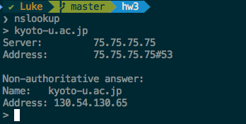
`130.54.130.65`
<br>
2. 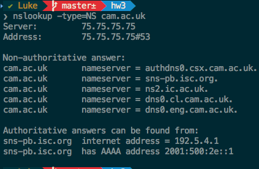
cambridge university:
authoritative servers:
`192.5.4.1` and `2001:500:2e::1`
3. 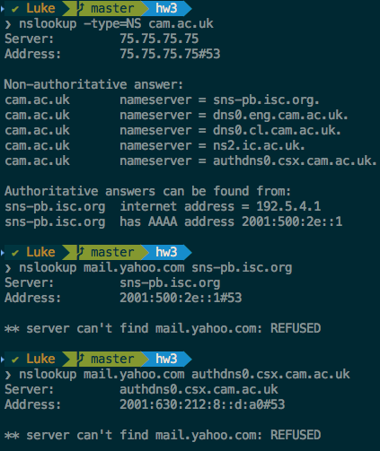
mail.yahoo.com was refused.

### 3. Tracing DNS with Wireshark ###

4. 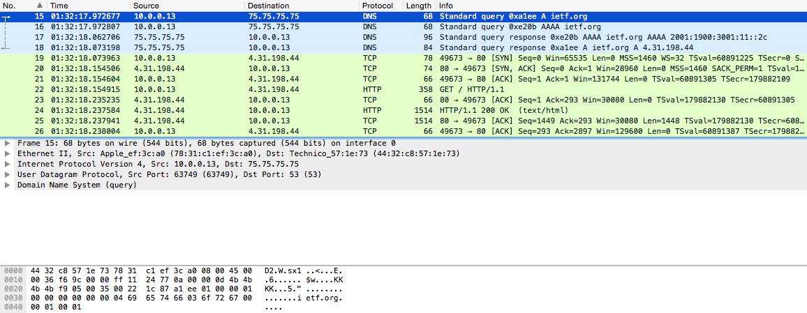
Clearly, UDP.

5.
|message | source    | destination |
|:------ | :---------| :---------- |
| query  | 63749     | 53          |
|response| 53        | 63749       |

6. 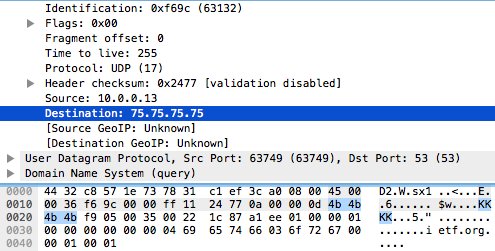
DNS Query message was sent to `75.75.75.75`
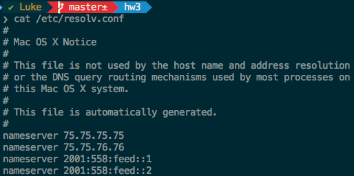
Yes, they are the same.

P.S.: `cat /etc/resolv.conf` shows IP address of local DNS server in Unix systems.

7. The message is clearly "type A" (standard host address resource record). No answers.

8. The DNS Type A query has only one response.
This is the response:

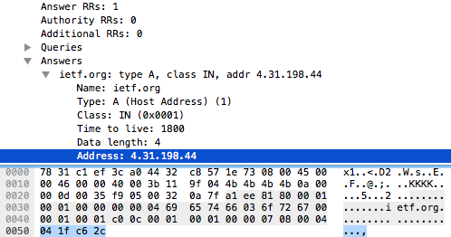

It contains some information, but most importantly, the IP address.

9. 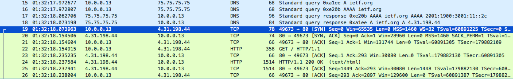
Yes, the destination address of the following TCP packet matches the IP from the last DNS response.
`4.31.198.44`

10. No, no additional queries are necessary. All pictures should be accessible from `4.31.198.44`.

11. `53` for query message destination and `53` for query response source.

12. Destination IP: `75.75.75.75`, same as my default local DNS server.

13. DNS Query message is Type A (standard). Query message contains no answers.

14. Three answers provided.
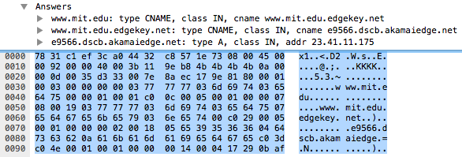

These are non-authoritative server aliases (canonical names). The last one contains the IP `23.41.11.75`.

15. 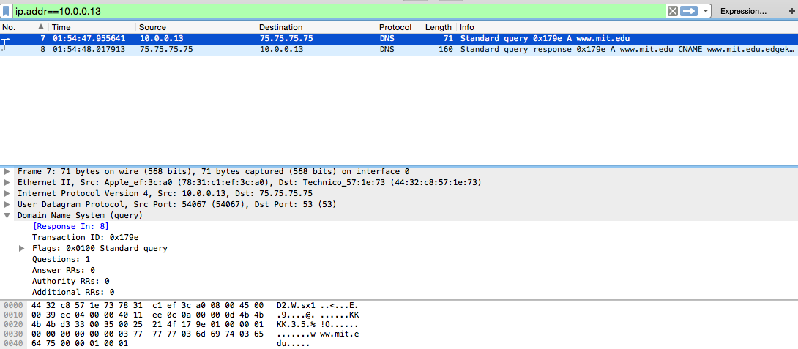
<br>
16. `75.75.75.75`. Yes it is.
<br>
17. Since we specified `-type=NS`, this is a `NS` (name server) query message. No answers.
<br>
18. ns1-37.akam.net
    ns1-173.akam.net
    use5.akam.net
    asia1.akam.net
    usw2.akam.net
    asia2.akam.net
    use2.akam.net
<br>
19. 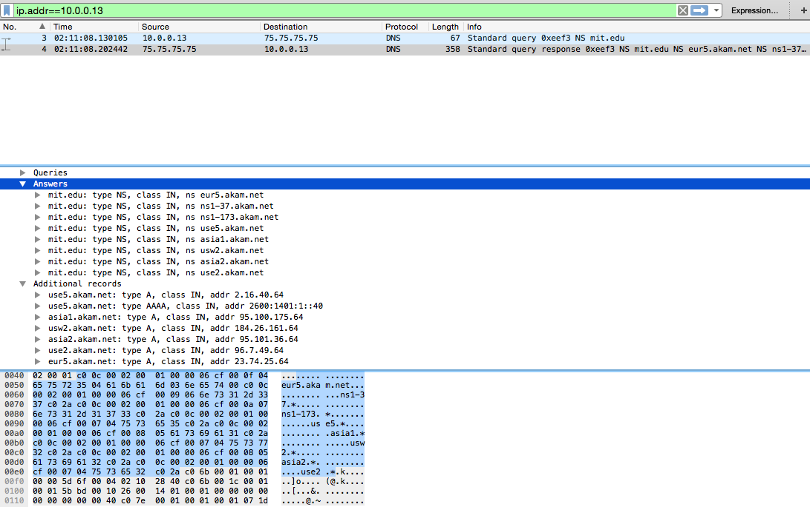


For this part, links are too old and acting weird.
I used `nslookup www.mit.edu 8.8.8.8` which is google's public DNS address.

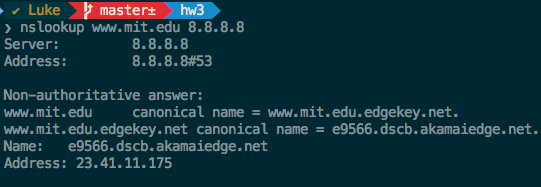

20. `8.8.8.8`. This is not my local DNS server's address, it corresponds to Google's public DNS.

21. Type A, no answers.

22. Three answers with the canonical names, and one host IP.
<br>
23. 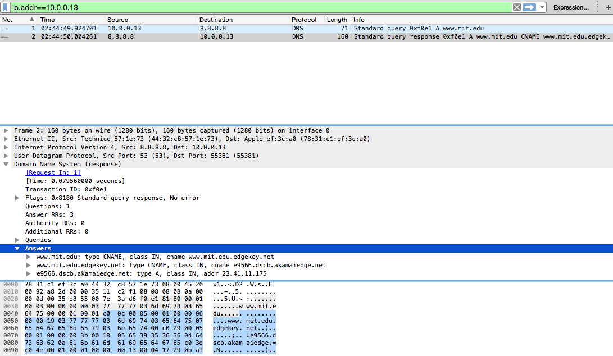

---

## Lab 2 ##

### capture trace ###

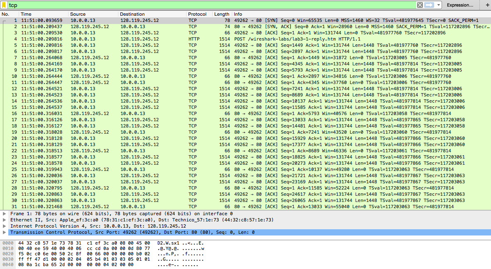

1. IP address: `10.0.0.13`, port: `49262`

2. IP address: `128.119.245.12` (gaia.cs.umass.edu) port: `80`

3. Source: IP address: `10.0.0.13` port: `49262`
sends the .txt file to: IP address: `128.119.245.12` port: `80`

### tcp basics ###

4. `Seq = 0`; `[SYN]` flag set to 1

5. `Seq = 0` and `Ack = 1`
gaia.cs.umass.edu adds 1 to the initial sequence number of `[SYN]`, which was 0. 0 + 1 = 1. `[SYN]` and `[ACK]` flag are set to 1, signaling this is a `[SYNACK]`

6. `Seq = 1`


7.
**seqs:**
 ```bash
   4. Seq = 1
   5. Seq = 1449
   6. Seq = 2897
   8. Seq = 4345
   9. Seq = 5793
   12.Seq = 7241
   ```

   **acks:**

   ```bash
   7. Ack = 1449
   10.Ack = 2897
   11.Ack = 4345
   16.Ack = 5793
   19.Ack = 7241
   22.Ack = 8689
   ```

   $EstimatedRTT=0.875 * EstimatedRTT + 0.125 * SampleRTT$

|segment|sent time|received time| RTT(sec)|
|:------|:--------|:------------|:------- |
|4      |00.209816|00.264068    |         |
|5      |00.209816|00.264444    |         |
|6      |00.209817|00.264447    |         |
|8      |00.264169|00.316031    |         |
|9      |00.264170|00.318028    |         |
|12     |00.264521|00.317513    |         |

   ```bash
   4. 00.209816
   5. 00.209816
   6. 00.209817
   8. 00.264169
   9. 00.264170
   12.00.264521

   7. 00.264068
   10.00.264444
   11.00.264447
   16.00.316031
   19.00.318028
   22.00.318513
   ```
