2.[30 points] Complete the following Wireshark labs:
http://www-net.cs.umass.edu/wireshark-labs/Wireshark_IP_v6.0.pdf
http://www-net.cs.umass.edu/wireshark-labs/Wireshark_ICMP_v6.0.pdf
http://www-net.cs.umass.edu/wireshark-labs/Wireshark_Ethernet_ARP_v6.01.pdf

3. [5 points] Read carefully section 5.7 "Retrospective: A Day in the Life of a Web Page Request" (Page 495) and make a list of all the protocols involved in the scenario described in the section: "a student, Bob, connects a laptop to his school’s Ethernet switch and downloads a web page (say the home page of www.google.com)".


# Homework 4 #

## Wireshark labs ##

#### Wireshark lab: IP v6.0 ####

**Captured Trace:**

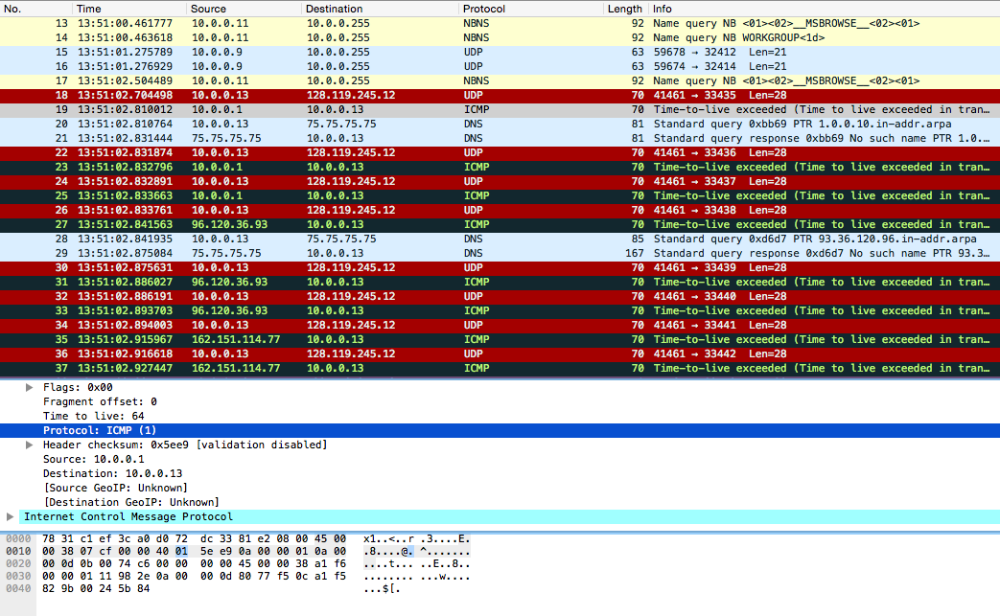

1. Computer: `10.0.0.13`
2. ICMP `(0x01)`
3. Header length: 20 bytes, Total Length: 56. $56-20=36$
36 bytes in the payload of the IP datagram.
4. Fragment offset: 0. No fragmentation.
5. Identification, Time to live and Header checksum.
6. _Fields that remain constant:_ Version (IPv4 for all), header length (ICMP packets), source IP (always sending from same source), destination, differentiated services (always ICMP type of service class), upper layer protocol.
Fields that must stay constant match the ones that remained constant.
_Fields that must change:_
Identification (IP packets must have different ids), TTL (traceroute increments each subsequent packet), Header Checksum (if header changed, checksum changes too).

7. The IP header Identification fields increment with each ICMP Echo request.

8. Identification: `0x07cd` (1999) TTL: 64

9. TTL remains unchanged because the TTL for the first hop router is the same.

**Fragmentation**

10. Yes.

11.

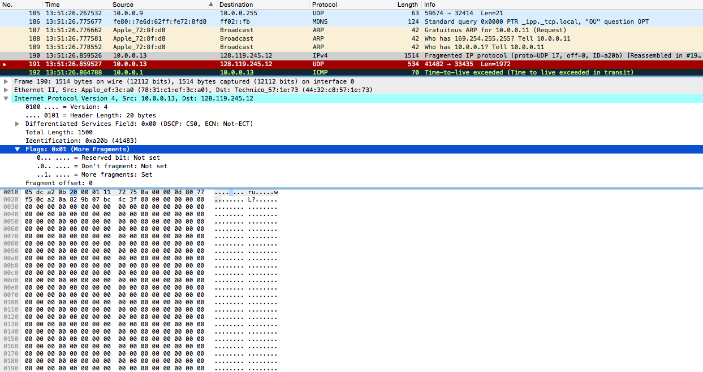

The "More fragments" flag is set.
Length: 1500 bytes.

12.
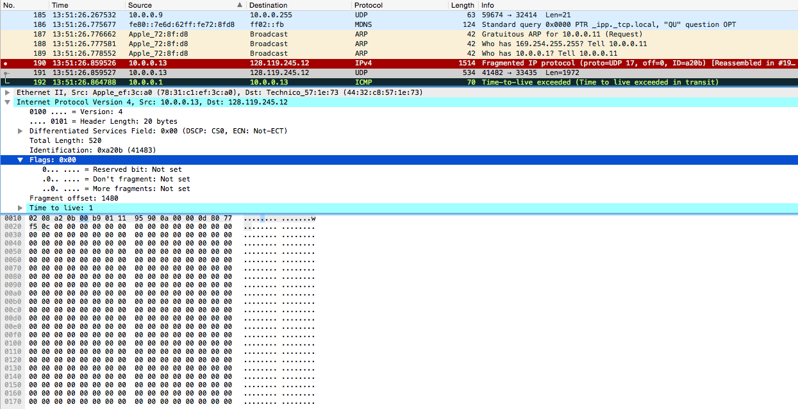

The following has fragment offset of 0, "More fragments: not set" (there are no more fragments from this point onwards).
The offset 1480 indicates it is the remainder of the fragment.

13. Total length, More Fragments and Fragment offset.

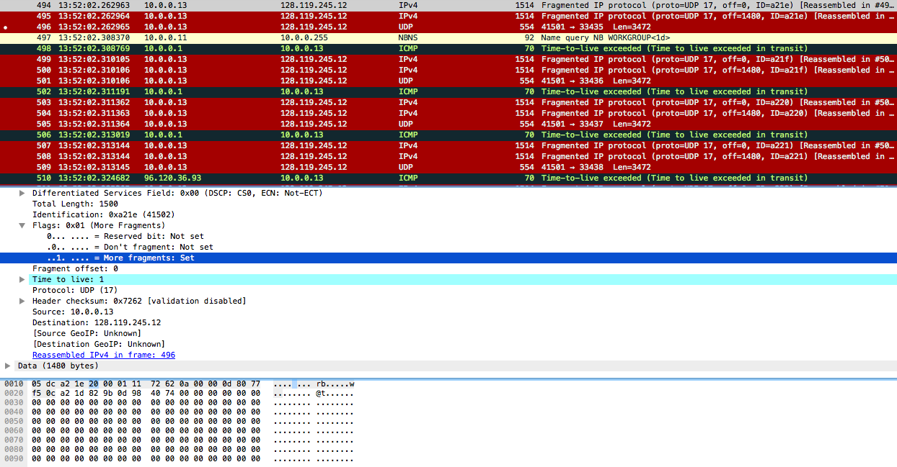


14. The original request created 2 fragments. 3 packets total.
15. From 1 to 2: fragment offset.
From 2 to 3: fragment offset, more fragments, total length.

#### Wireshark lab: ICMP v6.0

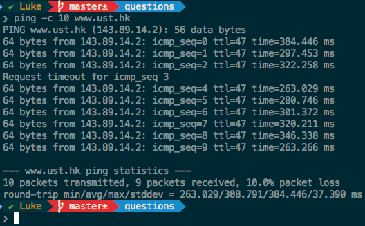

1. My IP: `10.0.0.13`
Host: `143.89.14.2`

2. Because it is a very simple protocol designed as a session less protocol, not designed for applications.

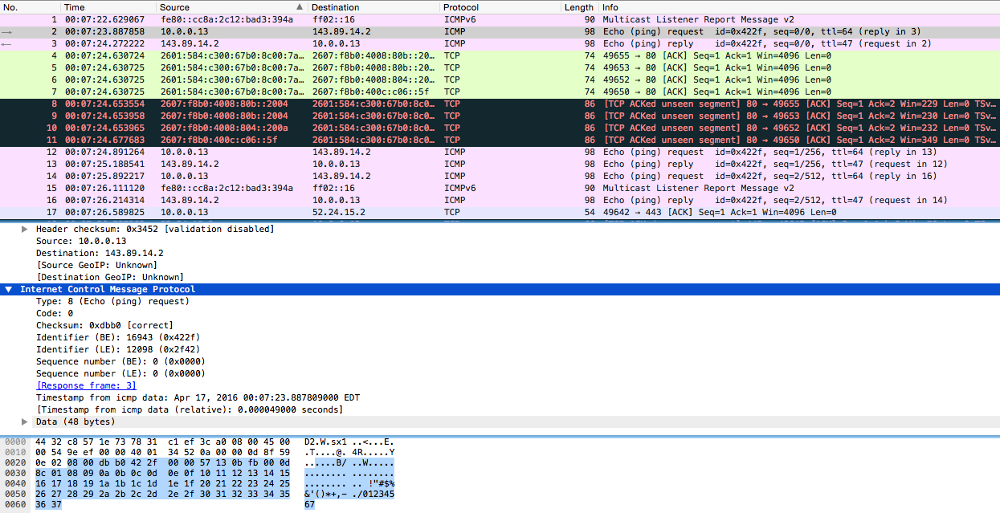

3. Type: 8 Code: 0. Checksum, Identifier, Sequence Number, Timestamp and Data. 2 bytes for each checksum, sequence number and identifier field

4. Type and code both 0. Checksum, Identifier, Sequence Number, and Data. Also 2 bytes for each checksum, sequence number and identifier field.

**2. ICMP and Traceroute**

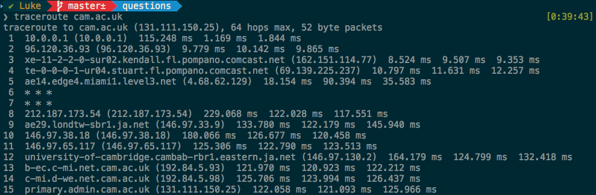

5. Host: `10.0.0.13` Destination: `131.111.150.25`

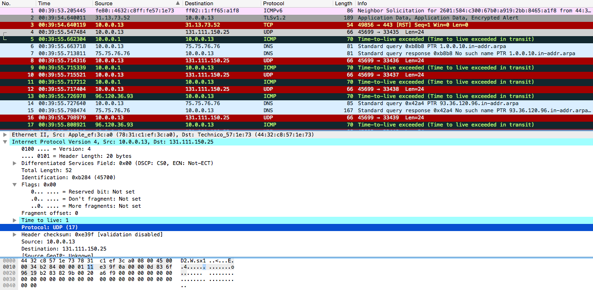

6. Since I am running Unix, I can verify that the ICMP IP protocol number is 0x11

7. Yes, same fields.

8.
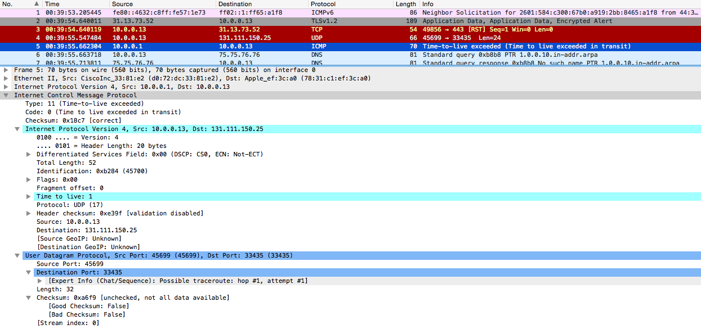

They are different packets. The ICMP contains both the IP header and the first 8 bytes of the original UDP packet request that the error is for.

9.

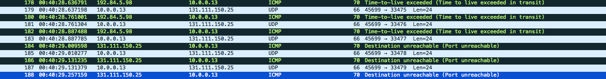

They are different in the sense that the last 3 three ICMP packets are message type 0 (echo reply), instead of 11 (TTL expired). This means that for the last ICMP packets the datagrams traveled all the way to the destination host before the Time To Live expired.

10. Since we were tracerouting from North America to Europe (Cambridge - UK), we clearly have a long hop, which is also described by the `***` (meaning waiting time) shown on the console. We start from Miami - FL (kendall.fl.pompano.comcast.net), to Stuart (stuart.fl.pompano.comcast.net). From Stuart we move into Comcast's backbone, Level 3 Communication is going to forward our traffic.
(network map available @ http://www.level3.com/~/media/files/maps/map_1115_interactive.pdf).
According to Level 3's map we most likely travel up to New York (miami1.level3.net) and from there we cross the Atlantic to reach the United Kingdom and that is when the longer waiting time starts. The last two routers:
```bash
14  c-mi.d-we.net.cam.ac.uk (192.84.5.98)  125.706 ms  123.994 ms  126.437 ms
15  primary.admin.cam.ac.uk (131.111.150.25)  122.058 ms  121.093 ms  125.966 ms
```
are most likely to be in the UK. (cam.ac.uk).


#### Wireshark lab: Ethernet ARP v6.01 ####


## Protocol List: ##

## Review Questions: ##
_Chapter 5:_
<s>R3</s>, <s>R5</s>, <s>R8</s>, <s>R9</s>, <s>R14</s>

**R3:**
- **Framing:** Each datagram received from the network layer is encapsulated in a frame by the Link-layer.
- **Link Access:** Link Layer specifies MAC protocol required for successful connection in case of multiple nodes using the same link.
- **Reliable Delivery:** Link-layer is responsible for having the network-layer datagram is delivered across the link without any errors.
- **Error detection and correction:** Link layer protocol is equipped with bit error detection potentially present in the frame. Link-layer is also able to correct such errors.

_Corresponding IP services:_
Framing, Link Access and Error detection and correction.

_Corresponding TCP services:_
Framing, Link Access, Reliable Delivery, Error detection and correction.

**R5:**
**Slotted ALOHA:**
1. Slotted ALOHA has a node to transmit continuously at maximum rate, all the time.
2. In slotted ALOHAm each of the nodes has a $\frac{R}{Mbps}$ throughput. Average transmission rate of $\frac{R}{M}$ for each node.
3. Each node detects collision and decides when to transmit independently (no clock). Partially decentralized.
4. Simple, efficient.

**Token Passing:**
1. Always has a node to transmit at $R$bps rate.
2. Each node has throughput of $\frac{R}{Mbps}$. Average transmission rate of $\frac{R}{M}$ for each node.
3. Decentralized.
4. Simple, inexpensive.

**R8:**
In token-ring, a node can only send the frame when it has the token. In a large lan perimeter, each node will have to wait longer for its turn. Each node has to wait until its frame propagates around the entire ring before passing the token to the next node. Therefore, token-ring is an inefficient protocol when the LAN has a large perimeter.


## Problems: ##
<s>P1</s>, <s>P5</s>, <s>P11</s>, <s>P31</s>, <s>P32</s>

**P1:**
Bit pattern: `1110 0110 1001 1101`
Parity: Even

| Bits| Parity (row) |
| :-   | :- |
| 1110 | 1 |
| 0110 | 0 |
| 1001 | 0 |
| 1101 | 1 |

We organize the bits from last table in columns and calculate the parity vertically:

| a | b | c | d |
| :-|:- |:- |:- |
| 1 | 1 | 1 | 0 |
| 0 | 1 | 1 | 0 |
| 1 | 0 | 0 | 1 |
| 1 | 1 | 0 | 1 |
|parity: 1 |parity: 1 |parity: 0 |parity: 0 |

Resulting in:
`1100`, which has horizontal (row) parity of: `0`

For the final result, we interleave the original data with its row parity.

`1110 1 0110 0 1001 0 1101 1`

Now we add the resulting value from the column parity calculation and again interleave with its row parity, leaving us with the final result of:

`1110 1 0110 0 1001 0 1101 1 1100 0`

**P5:**

$G=10011$
$D=1010101010$

We start by rewriting $G$ in terms of a polynomial expression:

$=(x^4\cdot 1)+(x^3\cdot 0)+(x^2 \cdot 0)+(x^1 \cdot 1)+(x^0\cdot 1)$<br>
$=(x^4+x^1+1)$

$G(x)=x^4+x^1+1$
The degree of the expression is 4, therefore our $r=4$
So, we will append $4$ `0s` to $D$

$D=1010101010$
$D+r=1010101010\,\,0000$

To calculate the value of R:
$$R=\frac{D+r}{G}$$

- CRC operation used for division is the XOR operator
- XOR operations results in 0 when both the bits are equal; 1 otherwise.
We divide $$\frac{10101010100000}{10011}$$

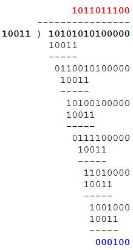

$R=0100$

**P11:**
number of packets at each node $= \infty$
probability required by each node to transmit packet in each slot is $p$
Assuming probability of success $= p$
number of failures $q=1-p$

_Probability of A succeeding in a slot is:_
$P(A)=(A\,transmits)(B\, not)(C\, not)(D\, not)$
$P(A)=p\cdot (1-p)\cdot (1-p)\cdot (1-p)$
$P(A)=p(1-p)^3$

**a:**
_Probability of A succeeding for the first time in slot 5:_
$P=P(A\, fails\, slot\, 1)\cdot(A\, fails\,slot\,2)\cdot (A\,fails\,slot\,3)\cdot(A\,succeeds\,slot\,5)$
$P=(1-P(A))^4\cdot P(A)$
$P=(1-(p(1-p)^3))^4\cdot p(1-p)^3$

**b:**
_Probability of A succeeding in a slot 4:_
$P(A)=(A\,not)(A\,not)(A\,not)(A\,succeeds)$
$P(A)=p\cdot (1-p)\cdot (1-p)\cdot (1-p)$
$P(A)=p\cdot(1-p)^3$

Similarly;
_Probability of B succeeding in slot 4:_
$P(B)=p\cdot (1-p)^3$

_Probability of C succeeding in slot 4:_
$P(C)=p\cdot (1-p)^3$

_Probability of D succeeding in slot 4:_
$P(C)=p\cdot (1-p)^3$

**b.** _Probability of any node succeeding in slot 4:_
Since the nodes are mutually exclusive;
$=[p\cdot(1-p)^3]+[p\cdot(1-p)^3]+[p\cdot(1-p)^3]+[p\cdot(1-p)^3]$
$=4\cdot p \cdot (1-p)^3$

**c.**

_Probability that any node succeed in a slot:_
$4p(1-p)^3$

_Probability that any node does not succeed in a slot:_
$1-4p(1-p)^3$

_Probability of success is first for slot 3 is:_
$P=P(fails\,first)\cdot P(fails\, second)\cdot P(success\, third)$
$P=(1-(4p(1-p)^3))\cdot (1-(4p(1-p)^3))\cdot (4p(1-p)^3)$
$P=(1-(4p(1-p)^3))^2(4p(1-p)^3)$
$P=1-(4p(1-p)^3)^2(4p(1-p)^3)$

**d.**
_Efficiency of the 4 node system:_

Efficiency can be described as the probability of any node succeeding in a slot:
$P=4p(1-p)^3$

**P31:**

1. Connect PC to the network using Ethernet Interface
2. DHCP provides an IP address to the PC (steps follow):
1.. PC creates an IP datagram with dest: `255.255.255.255` in DHCP's server discovery step.
2.. Datagram is placed in an Ethernet frame, sent and the router broadcasts it to the network.
3.. DHCP server residing in the DHCP provides the PC with a list of addresses of the routes with one hop, as well as subnet mask and subnet where the PC resides. Also a DNS server if it exists.
3. The ARP cache for the PC is starts empty. ARP protocol is used by the PC in order to obtain MAC address of first-hop routers and local DNS server.
4. PC first obtains IP address of the webpage requested. If local DNS server does not have it, DNS protocol is used so the computer can obtain the appropriate IP address.
5. Once this IP is obtained, PC will send an HTTP request using the first-hop router.
6. The PC then sends the Ethernet frames to the router.
7. The PC sends Ethernet frames destined to the router.
8. Upon receiving, the first-hop router passes the frames up to the IP layer, and checks its routing table. The router sends the packets to the right interface.
9. IP packets are routed through the internet until they arrive at the Web server.
10. Server hosting the Web page will send back the Web page to the PC using HTTP messages.
11. Such TCP messages are then encapsulated into TCP packets and further into IP packets.
12. IP packets then follow IP routes and eventually reach first-hop router.
13. Router forwards these IP packets to the user PC by encapsulating them into Ethernet frames.

**P32:**

Number of flow pairs $=80$
Capacity of each link $=10\,Gbps$
Capacity of the link between TOR switches and hosts $=1\,Gbps$

Each flow traversing over a same link shares the capacity of the link with other flows because each link is shared.

Maximum flow rate determines link capacity required for each flow in the network.

**a.**
Maximum rate of flow: $$=\frac{Link\ Cap}{Number\,of\,flow\,pairs}$$

$[1\,Gbps=1000\,Mbps]$</br>
$=\frac{10\,Gbps}{80}=\frac{10,000\,Mbps}{80}=125\,Mbps$

**b.**
_Highly interconnected topology:_

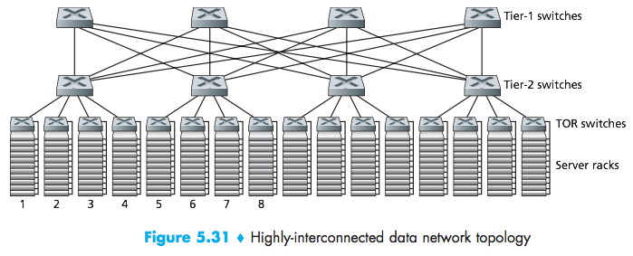

Every switch in Tier-1 has connection with every switch in Tier-2. Since we only have 4 hosts involved in the network on each host, number of paths between a tier-1 to tier-2 switches is 4.

Maximum rate of flow determines the capacity at which all the data paths are transmitting.

Number of paths $= 4$
Capacity of each link $= 10\,Gbps$
Maximum rate of flow $= 4\cdot 10\,Gbps = 40\,Gbps$

**c.**
_Data center network using Hierarchical topology:_

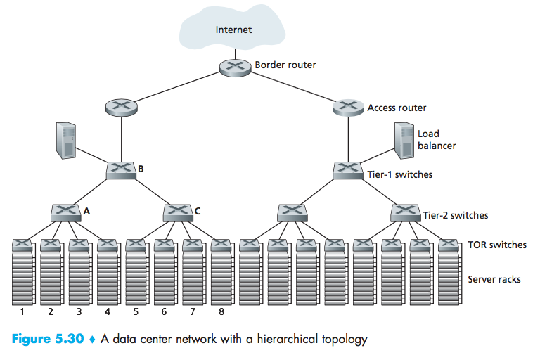

Number of flow pairs $= 160$
Capacity of each link $= 10\,Gbps$</br>
Maximum rate of flow $= \frac{10\,Gbps}{160}$
$=\frac{10,000\,Mbps}{160} = 62.5\,Mbps$

_Highly interconnected network:_

Every switch in Tier-1 has a connection to every switch in Tier-2. The number of paths from a tier-1 switch to tier-2 switches is 20 because 20 hosts are involved in the network.

Number of paths $=20$
Capacity of each link $=10\,Gbps$
Maximum rate of flow $=20\cdot 10\,Gbps = 200\,Gbps$

With $160$ flow pairs, the maximum rate of flow is $200\,Gbps$
