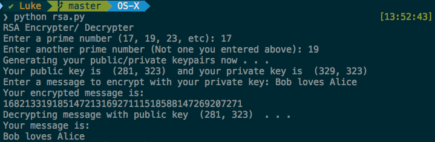
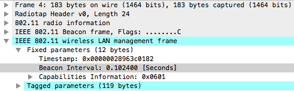
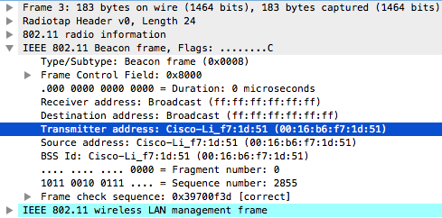
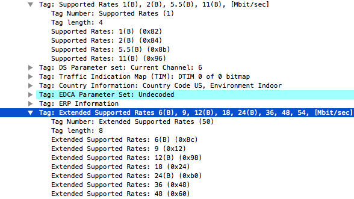
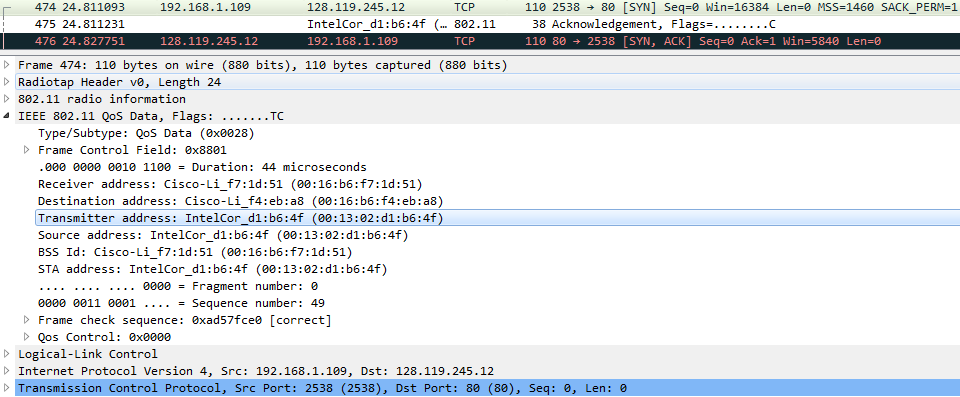
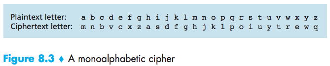
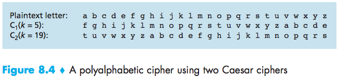
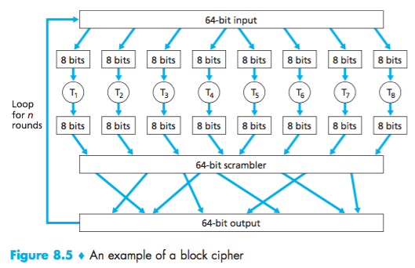

# Homework 5 #
#### lukas_borges ####

a) <s>Run the program and enter as prime numbers 17 and 19. What is the public key and the private key?</s>
b) <s>Give a brief explanation (less than a paragraph) of the following functions from the python code: -gcd(a, b) (line 14)
-multiplicative_inverse(e, phi) (line 22)
-is_prime(num) (line 49)</s>
 c) Explain differences and similarities between the RSA algorithm discussed in class (pages 685-686) and the implementation found in the code: generate_keypair (line 59), encrypt(line 86), decrypt(line 94).

http://www-net.cs.umass.edu/wireshark-labs/Wireshark_802.11_v6.0.pdf
http://www-net.cs.umass.edu/wireshark-labs/Wireshark_SSL_v6.0.pdf

Chapter 6 Review Questions: <s>R1,R2,R5,R7,R8</s>
Chapter 6 Problems: <s>P1, P5, P6</s>

Chapter 8 Review <s>R1,R2,R3,R4, R7, R9, R12, R16, R19, R23</s>
Chapter 8 Problems: <s>P1, P3, P4, P7, P8</s>

## RSA encryption: ###

1. 
a) at $GCD(a,b)$ we find the greatest common divisor between two prime numbers. It is used to make sure that $n$ (product of $p\cdot q$) has no common factors (other than 1) with $e$
b) In mathematics, the multiplicative inverse of $x$ is $\frac{1}{x}$; because $x \cdot \frac{1}{x} = 1$. It is used in this program to generate the private key, in the sense that the variable $d$ (used to decrypt) when multiplied by $e$ and subtracted 1 $((e\cdot d)-1)$ has to be exactly divisible by $z$ (no remainder).
c) page 686

## Wireshark Labs ##
### 802.11 ###

1. 30 Munroe St and linksys_SES_24086
2. `0.102400` Seconds for both.

3. `00:16:b6:f7:1d:51`

4. `ff:ff:ff:ff:ff:ff`
5. Since this is a beacon frame, the MAC Basic Service Set (BSS) ID is the same as the source address: `00:16:b6:f7:1d:51`
6. Supported rates: `1.0, 2.0, 5.5, 11.0 Mbit/s.`
Extended rates: `6.0, 9.0, 12.0, 18.0, 24.0, 36.0, 48.0, 54.0 Mbit/s`

#### Data Transfer: ####
7. Receiver, Destination, Transmitter, and Source addresses.
Receiver address: `00:16:b6:f7:1d:51`
Destination address: `00:16:b6:f4:eb:a8`
Transmitter Address and Source Address: `00:13:02:de:b6:4f`
Receiver address: `00:16:b6:f7:1d:51`
Destination address: `00:16:b6:f4:eb:a8`
Transmitter Address and Source Address: `00:13:02:de:b6:4f`
Host: `00:13:02:de:b6:4f`
Access point: `00:16:b6:f4:eb:a8`
First-hop router: `00:16:b6:f7:1d:51`
Wireless host (sending TCP segment): `192.168.1.109`
Destination IP address: `128.119.245.12`
`128.119.245.12` corresponds to the URL `gaia.cs.umass.edu`.
The destination MAC address of the frame containing the SYN is different from the destination IP address of the IP packet contained within the frame.

8. TCP SYNACK at $t=24.827751$
MAC Addresses: Receiver, Destination, and Transmitter addresses.
Host: `91:2a:b0:49:b6:4f` (different from the host used in the frame that sent the TCP SYN. This host wireless interface seems to have two interface addresses).
Firt-hop router: `00:16:b6:f4:eb:a8`
Access point: `00:16:b6:f7:1d:51`
IP address of server sending TCP SYNACK: `128.199.245.12`
Destination address: `192.169.1.109`

#### Association/Dissociation: ####

9. The only possible frame is at $t=49.609617$ because the host sends a DHCP release to the DHCP server (IP: 192.168.1.1) in the network which the host is exiting. The host sends a frame type=00m subframe type=12 (to deauthenticate).

10. First AUTHENTICATION frame from host to AP is at $t=49.638857$

11. The host requests association to be open (Open system)

12. After a thorough look, there are no replies from AP. The AP is likely to require a key when associating with that AP, which is why it refuses to respond open access requests.

13. $t=63.168087$, AUTHENTICATION frame;
Source: `00:13:02:d1:b6:4f` (wireless host)
Destination: `00:16:b7:f7:1d:51` (BSS)
$t=63.169071$, ASSOCIATE RESPONSE
From BSS `00:16:b7:f7:1d:51`
to wireless host `00:13:02:d1:b6:4f`

14. $t=63.169910$
ASSOCIATE REQUEST frame
Source: `00:1302:d1:b6:4f` (wireless host)
Destination: `00:16:b7:f7:1d:51` (BSS)
$t=63.192101$
ASSOCIATE RESPONSE frame
Source: `00:16:b7:f7:1d:51` (BSS)
Destination: `00:1302:d1:b6:4f` (wireless host)

15. ASSOCIATION REQUEST frame support rates are advertised:
1, 2, 5.5, 11, 6, 9, 12, 18, 24, 32, 48, and 54 Mbps.
same for ASSOCIATION RESPONSE.

#### Other Frame Types: ####

16. (Probe Request and Probe Response):
$t=2.297613$ (Probe Request)
Source: `00:12:f0:1f:57:13`
Destination: `ff:ff:ff:ff:ff:ff`
BSSID: `ff:ff:ff:ff:ff:ff`
$t=2.300697$ (Probe Response)
Source: `00:16:b6:f7:1d:51`
Destination: `00:16:b6:f7:1d:51`
BSSID: `00:16:b6:f7:1d:51`
_Purpose:_
Probe Request: Host uses probe request in active scanning mode to find an AP.
Probe Response: Access point sends this response to the host sending the request.

### SSL ###

## Questions ##
#### Chapter 6 ###
#### Review Questions ####

**R1.** Infrastructure mode:
- Common mode wireless networks operate on.
- Used when PC is connected to a wireless access point or a wireless router.
- If hosts are connected to network via base station or access point (fixed infra structure)
- Cellular networks work in infrastructure mode because all cellphones connect to network through base stations.

If network is not in infrastructure mode, it is operating in Ad hoc mode. In Ad hoc, wireless hosts can communicate with each other without access point. No fixed infrastructure such as access point is required for the wireless hosts.

**R2.**

| type | description |
| :--- | :---------- |
|Single-hop, infrastructure-based|No base station. Base station connected to large wired network |
|Single-hop, infrastructure-less |No base station required for hosts to connect to network|
|Multi-hop, infrastructure-based |Base station is connect to larger wired network. Some nodes reach the netwok by connecting with other nodes.|
|Multi-hop, infrastructure-less  |No base station required for nodes to connect to network. Hosts relay messages among several nodes|

**R5.** In 802.11 networks The role of the beacon frame is to help a wireless station to discover and identify a nearby Access point (AP) to associate with.

**R7.** Wireless channels have high bit error rates. To mitigate this problem, 802.11 MAC protocol uses an acknowledgement scheme. In wired Ethernet bit error rates are lower and the transmission is quite reliable, therefore, there is no need for acknowledgements.

**R8.** False. There is no preamble in 802.11 because it is sent by the hardware and not treated as a part of a data link packet (unlike what happens in Ethernet).
Ethernet packets are a little bit simpler.

#### Problems ####

**P1.**
Data bits $d_0=1$, $d_1=-1$
CDMA code cm = (1, -1, 1, -1, 1, -1, 1, -1)

We calculate the sender's output $Z_{i,m}$ by multiplying data bit $d_i$ with mth bit cm in the given CDMA code:

$Z_{i,m} = d_i \cdot c_m$

| Data($d_0$) | CDMA code(cm) | Output($Z=d_0 \cdot cm$)|
| :---------: |:-------------:| :---------------------: |
| 1           | 1,-1,1,-1,1,-1,1,-1| 1,-1,1,-1,1,-1,1,-1|

| Data($d_0$) | CDMA code(cm) | Output($Z=d_0 \cdot cm$)|
| :---------: |:-------------:| :---------------------: |
| -1          | 1,-1,1,-1,1,-1,1,-1| -1,1,-1,1,-1,1,-1,1|

$d_0 = (1, -1, 1, -1, 1, -1, 1, -1)$
$d_1 = (-1, 1, -1, 1, -1, 1, -1, 1)$

**P5.** **a.** The protocol does not completely break down. The two APs will have different SSIDs and MAC addresses and one of the SSISs will be assigned to the wireless station that connect to the cafe.
A virtual link between the new station and the AP is maintained.
The two APs can work in parallel over the same channel, the transmission might be degraded (two stations transmitting over the same channel). Collision might happen if both stations attempt to transmit over the same channel at the same time.

**b.** The two stations (each from a different ISP) can transmit data at the same time without collisions. The performance will be upgraded when one AP operates over channel 1 and the other over channel 11. Both APs are using non-overlapping channels, two stations transmitting over different channels.

**P6.** **a.** CSMA/CA exists so that a station does not transmit the second frame immediately even if the channel listened is idle. It is done so to avoid collision. If station A is transmitting first frame and station B has data frames to transmit:
_In CSMA/CD:_ B senses the channel, finds out the channel is busy and waits for channel to be free (idle). After successfully transmitting the first frame, A wants to send the second frame. After A finishes transmitting the first frame, A and B both listen to the channel at the same time. Both will find the channel idle and both will start transmission of data at the same time, which will lead to collision. CSMA/CD protocol detects transmission and station A and B abort the transmission.

**b.**
_In CSMA/CA:_ After station A receives the acknowledgement for the first frame, it begins the CSMA/CA for a second frame at step 2 instead of step 1. Station A senses the channel; if it's idle it starts the counter, but does not transmit the second frame immediately. Once counter hits zero, A senses the channel again and sends the data frame if the channel is idle. If not it enters in random back-off. Station B also senses the channel, sends the first frame if it finds the channel idle. If not, it also enters the random back off time.

Whichever station finds the channel idle first sends the frame.

### Chapter 8 ###
#### Review Questions ####
**R1.**

| Confidentiality | Integrity      |
| :-------------  | :------------- |
|Attacker cannot understand original plain text (even if he accesses to the encrypted message)|Receiver can determine whether a message was changed during transmission|
|only sender and receiver understand original message|ensures original message is not changed during transmission|
|encryption and decryption ensure confidentiality|checksum is used to achieve integrity|
|encryption is applied to plain text |checksum is applied to encrypted data|

These are two independent techniques.
Messages can have either or other independently. An attacker might be able to change a message without understanding what it means, as much as being able to snoop messages without necessarily changing their content.

**R2.** Clients/Servers might require secure information communication (email, ecommerce and online banking)

DNS servers have to exchange host IP addresses in a secure manner

Routers have to exchange routing information securely

**R3.**
| Symmetric key | Public key |
| :------------- | :------------- |
|single secret key encrypts and decrypts data|pair of keys, one for encryption and one for decryption|
|both sender and receiver know the key|encryption key is available to all, only receiver can decrypt|

**R4.**
Known-plaintext attack occurs when intruder knows some of the plaintext and its corresponding decrypted text pair. Intruder can come up with a known-plaintext attack according to the example.

**R7.** $n=10,000, a=10,023, b=10,004$
calculate: $(a\cdot b)mod\,n$

$(a\cdot b)\,mod\,n=[(a\,mod\,n)\cdot(b\,mod\,n)]mod\,n$

$[(10,023\,mod\,10,000)\cdot (10,004\,mod\,10,000)]mod\,10,000$

$=[23\cdot 4]mod\,10,000$
$=92\,mod\,10,000$
$=92$

**R9.**
Two different messages $x$ and $y$ will never equal to each other once hashed. $H(x)\neq H(y)$.

The intruder can never forge the contents of another message $y$ that has same hash value as original message. $(m, H(m))$

Hash provides overall better message integrity check.

 **R12.** _Verifiable:_ It is possible to prove that the document is signed by some specific user. If Alice receives a message and cipher message $(m, K_{B}^-(m))$ encrypted with Bob's private key $K_B(m)$. Alice can decrypt the cipher message using Bob's public key $K_{B}^+$ . The message is verified when $m=K_B^+(K_{B}^-(m))$

 _Non-forgetable:_

 Only Bob has the private key $K_{B}^-$and only whoever holds the private key can decrypt cipher text encrypted with its corresponding public key.

  **R16.** An nonce is a number used to identify whether the sender is live or not. An end-point never repeats an nonce already listed, which helps mitigating replay attacks (intruder using the same number in order to fool the system into thinking it is someone else).

  **R19.** PGP is digitally signed message.
  Alice encrypts the message digest $(H(m))$ with a private key $(K_{A}^-)$ and sends $(m, K_{A}^-(H(m)))$. Bob receives the digitally signed message, decrypts the signature using Alice's public key $K_{A}^+(K_{A}^-(H(m)))$ and gets the message digest $(H(M))$

  Bob calculates the digest from $(H(m))$. If the message digest computed by Bob is the same as the one computed by his decryption, Bob can be sure the message was create and sent by Alice. PGP does not use MAC for message integrity.

  **R23.**
  
   According to the steps listed in the book, in the last step (step6) of SSL handshake when Trudy sends MAC of messages. Trudy's MAC messages will fail to pass the MAC test and Bob will know he is not communicating with Alice.

#### Problems ####
**P1:**

encode:
> This is an easy problem

**Uasi si mj cmiw lokngch**

decode:
>rmij’u uamu xyj

**wasn't that fun**

**P3:**

> The quick brown fox jumps over the lazy dog.

No, because in this case an attacker does not know the cipher character for every plain text character.

**P4:**

Supposing the cipher block merely reverses 8 bits:
11110000 $\rightarrow$ 00001111
scrambler is "offline"

**a)**
$n=3$
64bit input:
`10100000 10100000 10100000 10100000 10100000 10100000 10100000 10100000`
3 rounds:

_round 1:_
`00000101 00000101 00000101 00000101 00000101 00000101 00000101 00000101`

_round 2:_
`10100000 10100000 10100000 10100000 10100000 10100000 10100000 10100000`

_round 3:_
`00000101 00000101 00000101 00000101 00000101 00000101 00000101 00000101`

result: `00000101`

**b)**
$n=3$

_round 1:_
input: `10100000 10100000 10100000 10100000 10100000 10100000 10100000 10100000`
output: `00000101 00000101 00000101 00000101 00000101 00000101 00000101 10000101`

_round 2:_
input: `00000101 00000101 00000101 00000101 00000101 00000101 00000101 10000101`
output: `10100000 10100000 10100000 10100000 10100000 10100000 10100000 10100001`

_round 3:_
input: `10100000 10100000 10100000 10100000 10100000 10100000 10100000 10100001`
output: `00000101 00000101 00000101 00000101 00000101 00000101 00000101 10000101`

result: `00000101 00000101 00000101 00000101 00000101 00000101 00000101 10000101`

**c)** (repeating part a):
_round 1:_
input: `00000101 00000101 00000101 00000101 00000101 00000101 00000101 00000101`
output: `10100000 10100000 10100000 10100000 10100000 10100000 10100000 10100000`

_round 2:_
input: `10100000 10100000 10100000 10100000 10100000 10100000 10100000 10100000`
output: `10100000 10100000 10100000 10100000 10100000 10100000 10100000 10100000` (unchanged)

_round 3:_
input: `10100000 10100000 10100000 10100000 10100000 10100000 10100000 10100000`
output: `10100000 10100000 10100000 10100000 10100000 10100000 10100000 10100000` (unchanged)

**d)** (repeating part b):

_round 1:_
input: `00000101 00000101 00000101 00000101 00000101 00000101 10000101`
output: `10100001 10100000 10100000 10100000 10100000 10100000 10100000 10100000`

_round 2:_
input: `10000101 00000101 00000101 00000101 00000101 00000101 00000101 00000101`
output: `10100000 10100000 10100000 10100000 10100000 10100000 10100000 10100001`

_round 3:_
input: `00000101 00000101 00000101 00000101 00000101 00000101 00000101 10000101`
after reversion and after 3 rounds:
output: `10100001 10100000 10100000 10100000 10100000 10100000 10100000 10100000`

**P7:**
**a)**
$p=3, q=11$
RSA:
$n=p*q$
$n=3*11=33$

$z=(p-1)*(q-1)$
$z=(3-1)*(11-1)=20$

$e < n$, no common factors (other than 1) with $z$
e can be 31, 29, 27, 23, 21, 19, 17, 13, 11, 9 (...)
for the sake of simplicity, we choose
$e=9$
factors of 20: 2, 4, 5, 10
factor of 9: 3 (no common factors)

$d\,|\,ed \ -1$ is exactly divisible by $z$ or
$ed\,mod\,z=1$

$9d\,mod\, 20=1$

$d=29$ works because $9 * 29=261$
$261 - 1 = 260;\,260 \div 20 = 13$ (no remainder)

_encrypt:_
> dog

$m^e\,mod\, n=ciphertext$

| plain | numeric value | $m^e$ | $(m^e)\,mod\,n$ |
|:-----:|:-------------:|:-----:|:---------------:|
|d      |4              |262144 |25               |
|o      |15             |38443359375|3            |
|g      |7              |40353607|19              |

**25 3 19**

_decrypt:_
> 25 3 19

$d=29, n=33$

| cipher |$c^d$  |$m=c^d\,mod\,n$|plain|
|:------:|:-----:|:-------------:|:---:|
|25      |$25^29$|         4     |   d |
|3       |68639377364883|15      |   o |
|19      |$19^29$|         7     |   g |

**b)**
| plain | m | m=5bit |
|:-----:|:-:|:------:|
|d      |4  |`00100`|
|o      |15 |`01111`|
|g      |7  |`00111`|

combining all 5 bit character representations:
`00100 01111 00111` (15 bit)
$(001000111100111)_2=4583_{10}$

Apply RSA again:

$m=4583, n=33$
we'll choose
$p=43, q = 107$

$n=p\cdot q$
$=43\cdot 107=4061$

$z=(p-1)\cdot (q-1)$
$=(43-1)\cdot (107-1)$
$=42\cdot 106 = 4452$

We'll choose $e=61$ because 61 and 4452 have no common factors (googled).

$d=73$ in the sense that $(61\cdot 73)-1 = 4452$ which is exactly divisible by $z$ (multiplicative inverse)

Ciphertext c = $m^e\, mod\, n$
$=4583^61\,mod\,4601 = 402$

**P8:**
$p=5, q=11$

**a)**
$n=p\cdot q$
$n=5\cdot 11 = 55$

$z=(p-1)\cdot(q-1)$
$z=4\cdot10=40$

**b)**
$e < n$, no common factors (other than 1) with $z$
$e=3$ satisfies it.

**c)**
$de=1\,mod\,z$ and $z<160$
$d\cdot3=1\,mod\,40$

$(d\cdot 3)-1$ must be exactly divisible by $z$, which is 40.

$(3*27)-1 = 80$, and $80\div40$ leaves no remainder.

$d=27$

**d)**
$m=8$
$n=55, e=3$
$c=cipher$
public key $K(n,e)$

_encrypt:_
| plain | m^e | $c=m^e\,mod\,n$|
|:-:|:-:|:-:|
|8|$8^3=512$|17 |

plain text: 8
cipher text: 17
