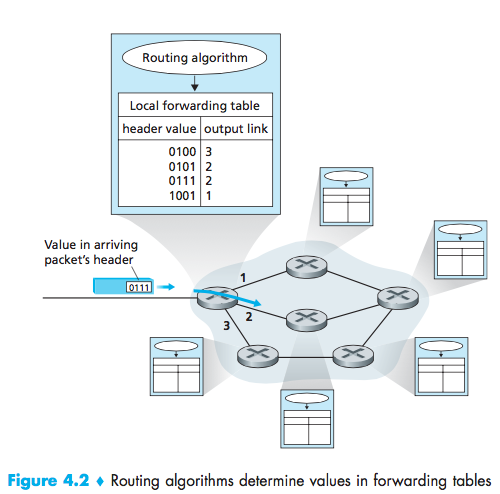
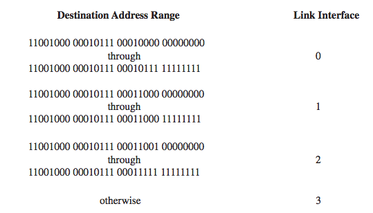
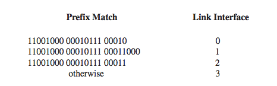
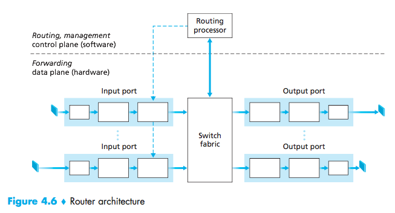
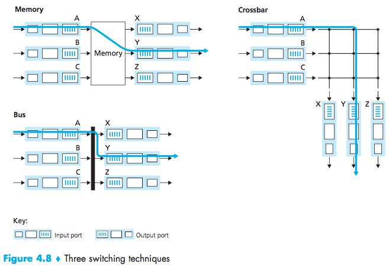
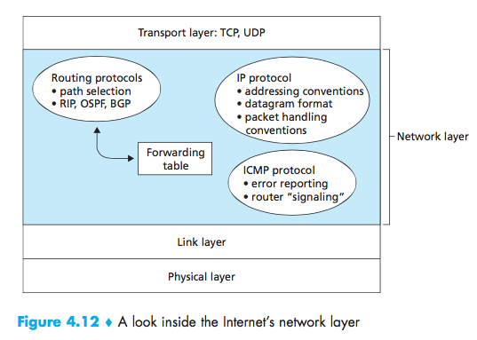
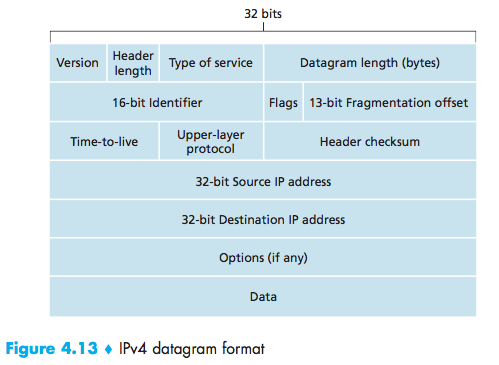

# Lecture 10 #

- Network layers protocol in every host and every router.
#### Funcionality: ####
_Sending side:_ encapsulate segments into datagrams.
_Receiving side:_ delivers segments to transport layer.

Two key functions:
- forwarding: moving objects from router input to the output (single interchange)
- routing: determine route takes by packets from source to destination (routing algorithm)

#### Longest Prefix Matching: ####

#### Example: ####
|header value|output link|
|:-:|:-:|
|`11001000 00010111 00010*** ********`|0|
|`11001000 00010111 00011000 ********`|1|
|`11001000 00010111 00011*** ********`|2|
|otherwise|3|

`11001000 00010111 00010110 10100001` goes to 0
`11001000 00010111 00011000 10101010` goes to 1

#### Internet network: ####
Service model: **best effort**
Does not guarantee:
- delivery
- order
- time between packets

Internet is a _datagram network_ (as opposed to a virtual circuit)
- no call setup
- no state about end-to-end connections
- packets are forwarded using the destination address

#### Router: ####
**functions:**
- forwading
- run routing
- Routing processor: compute forwarding tables, push to ports

**goal:** Given destination, lookup the output port

#### Switching Techniques ####

Downside of crossbar: waiting if two packets want to go to the same output.

#### IPv4: ####

**IP Fragmentation:**
_Different link layers have different size_
- Maximum Transmission Unit (MTU)
- Large IP Datagrams fragmented within the net
- One datagram will become several datagrams
- Only reassembled at the final destination
