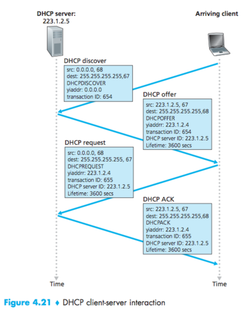

# Lecture 12 #

How to get the IP address.
DHCP: Dynamic Host Config Protocol [RFC 2141]

Goal: Allow host to dynamically obtain IP addresses from a network server.
- can renew lease
- allow reuse of addresses
- support for mobile users


The reason for steps 3 and 4 is because there might be more than one DHCP Server in the network, the device must accept only one offer.

ICMP: Internet Control Message Protocol [RFC 792]
- ping
- traceroute
- wireshark capture

Used by routers and hosts to communicate network level information.
errors: unreachable host or unreachable port, unreachable network or unreachable protocol.

### ICMP Message: ###
- type, code, first 8 bytes of datagram causing an error

|type|code|           message             |
|:--:|:--:|:-----------------------------:|
|  0 |  0 |          echo ready           |
|  8 |  0 |          echo request         |
|  3 |  0 |destination network unreachable|

port/host (book, page, 354)

## Routing Algorithms ##
_Section 4.5_
|destination addrress|output link|
|:------------------:|:---------:|
|       range1       |     0     |
|       range2       |     1     |
|       range3       |     2     |
|       range4       |     2     |
|         "          |    ...    |


$Graph = (Nodes, Edges)$
$Nodes = \{U,V,W,X,Y,Z\}$
$Edges = \{(uv),(ux),(vx),(vw)...\}$
$c(x,x') = cost of link (x,x')$
$(w,z)=5$

Cost:
- can be related to congestion
- can be inversely related to bandwidth
- related to distance

### Classification ###
- global: (complete knowledge) in all routers
- decentralized: router knows physically connected neighbors, link, cost to other neighbors

_static:_ routes change slowly over time
_dynamic:_ routes change quickly, periodic or when cost link changes.

### Link-State Routing Algorithm: ###
(Dijkstra's Algorithm)
- net topology, cost, known to all Nodes
- all nodes have the same information
- compute least cost path from one node to all others (this gives the forwarding table to all nodes)

$C(x,y)$: link cost from $x$ to $y$ = $\infty$ if no direct neighbors.
$D(v)$: current value of cost of path from source to destination $v$
$P(v)$: predecessor in route along the path from source to destination
$N'$: set of nodes whose least cost is known

```ruby
Initialization:
N’ = {u}
for all nodes v
if v is a neighbor of u then D(v) = c(u,v)
else D(v) = ∞
Loop
find w not in N’ such that D(w) is a minimum
add w to N’
update D(v) for each neighbor v of w and not in N’:
D(v) = min( D(v), D(w) + c(w,v) )
/* new cost to v is either old cost to v or known
least path cost to w plus cost from w to v */ until N’= N
```
We compare old path with new path until all nodes are N'

_step 1:_
$$D(v)=min(D(v), D(w)+C(w,v))$$$$D(w)=min(D(w), D(x)+C(x,w))$$ $$=5, (1+3)$$ $$D(y)=min(D(y), D(x)+C(x,y))$$ $$=\infty, (1+1)$$
_step 2:_
$$D(w)=min\{D(w), D(y)+C(y,w)\}$$ $$=4,(2+1)$$ $$D(z)=\{D(z), C(y,z)+D(y)\}$$ $$=\infty, (2+2)$$
_step 3:_
$$D(w)=min\{D(w), D(v)+C(v,w)\}$$ $$=3,(2+3)$$
_step 4:_
$$D(z)min\{D(z), D(w)+C(w,z)\}$$ $$=4,(3+5)$$

|step| $N'$| $D(v),P(v)$|$D(w),P(w)$|$D(x),P(x)$|$D(y),P(y)$|$D(z),P(z)$|
|:--:|:---:|:----------:|:---------:|:---------:|:---------:|:---------:|
|0   |  U  |   2,U      |  5,U      |  1,U      | $\infty$  |  $\infty$ |
|1   |  UX |   2,U      |  4,X      |  1,U      | 2,X       |  $\infty$ |
|2   | UXY |   2,U      |  3,Y      |  1,U      | 2,X       |  4,Y      |
|3   |UXYV |   2,U      |  3,Y      |  1,U      | 2,X       |  4,Y      |
|4   |UXYVW|   2,U      |  3,Y      |  1,U      | 2,X       |  4,Y      |
|5   |UXYVWZ|  2,U      |  3,Y      |  1,U      | 2,X       |  4,Y      |

Shortest path tree:
```ruby
V-U-X-Y-Z
      |
      W
```

### Distance Vector Algorithm ($D_v$) ###
Bellman-Ford equation (dynamic programming)

```ruby
Initialization:
for all destinations y in N:
Dx(y) = c(x,y) /* if y is not a neighbor then c(x,y) = ∞ */
for each neighbor w
Dw(y) = ? for all destinations y in N
for each neighbor w
send distance vector Dx = [Dx(y): y in N] to w
loop
wait (until I see a link cost change to some neighbor w or
until I receive a distance vector from some neighbor w)
for each y in N:
Dx(y) = minv{c(x,v) + Dv(y)}
if Dx(y) changed for any destination y
send distance vector Dx = [Dx(y): y in N] to all neighbors
forever
```

$$d_x(y) = cost\,of\,least\,costly\,path\,x\rightarrow y$$$$d_x(y) = min\{c(x,v)+d_v(y)\}$$

where:
$x$ = cost of neighbor
$d$ = cost from neighbor to destination $y$

$$d_x(y)=min\{(x,v)+d_v(y)\}$$

- node achieving minimum is the next in the shortest path.
- used in forwarding table

$$d_x(y)=estimate\,of\,least\,cost\,x\rightarrow y$$

X has the following information:
- distance vector to all nodes
$$D_x=[D_x(y): y \in N]$$
- cost to each neighbor v $c(x,v)$
- maintain its neighbor's distance vector
$$D_v=[D_v(y): y \in N]$$

_min. goes over all neighbors of x_

_example:_
$dv(z) = 5$
$dx(z) = 3$
$dw(z) = 3$

$$dv(z)=min\{c(u,x)+d_x(z), c(u,v)+d_v(z), c(u,w)+d_w(z)\}
=\{1+3, 2+5, 5+3\}
$$

Key idea of the algorithm:

- from time to time, each node sends its own distance vector estimate.
- when $x$ receives a new $D_v$ estimate from neighbor; it updates its own $D_v$ using $B\cdot F$
- $D_x(y)\leftarrow min\{c(x,v)+P_v(y)\}$ for each node $y \in N$


$$D_x(x) = 0$$ $$D_x(y)=min\{c(x,y),c(x,z)+D_z(y)\}$$ $$=min\{2+0,7+1\}$$ $$= 2$$

$$D_x(z)=min\{c(x,y),c(x,z)+D_z(y)\}$$ $$=min\{2+1,7+0\}$$ $$=3$$ 

after a few iterations of the algorithm we end up with:

$$D_z(x)=min\{c(z,x)+D_x(x),c(z,y)\}$$ $$=7+0,1+2+D_y(x)$$ $$=7,3$$

$$D_z(y)=min\{c(z,x)+D_x(x),c(z,y)\}$$ $$=7+2,1+0$$ $$=9,1$$

$$D_z(z)=0$$
