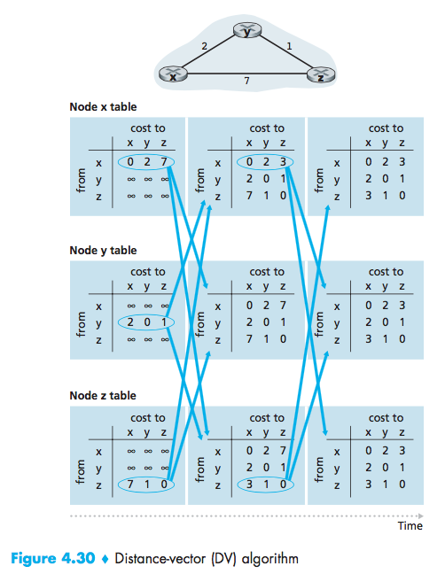
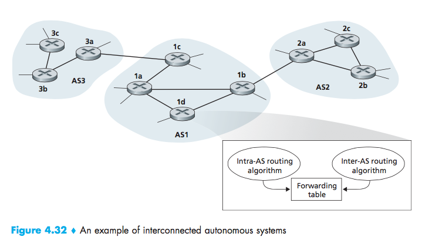

# Lecture 13 #
03/03/2016

### Distance Vector Algorithm ($D_v$) ###
Bellman-Ford equation (dynamic programming)

```ruby
Initialization:
for all destinations y in N:
Dx(y) = c(x,y) /* if y is not a neighbor then c(x,y) = ∞ */
for each neighbor w
Dw(y) = ? for all destinations y in N
for each neighbor w
send distance vector Dx = [Dx(y): y in N] to w
loop
wait (until I see a link cost change to some neighbor w or
until I receive a distance vector from some neighbor w)
for each y in N:
Dx(y) = minv{c(x,v) + Dv(y)}
if Dx(y) changed for any destination y
send distance vector Dx = [Dx(y): y in N] to all neighbors
forever
```

$$d_x(y) = cost\,of\,least\,costly\,path\,x\rightarrow y$$$$d_x(y) = min\{c(x,v)+d_v(y)\}$$

where:
$x$ = cost of neighbor
$d$ = cost from neighbor to destination $y$

$$d_x(y)=min\{(x,v)+d_v(y)\}$$

- node achieving minimum is the next in the shortest path.
- used in forwarding table

$$d_x(y)=estimate\,of\,least\,cost\,x\rightarrow y$$

X has the following information:
- distance vector to all nodes
$$D_x=[D_x(y): y \in N]$$
- cost to each neighbor v $c(x,v)$
- maintain its neighbor's distance vector
$$D_v=[D_v(y): y \in N]$$

_min. goes over all neighbors of x_

_example:_
$dv(z) = 5$
$dx(z) = 3$
$dw(z) = 3$

$$dv(z)=min\{c(u,x)+d_x(z), c(u,v)+d_v(z), c(u,w)+d_w(z)\}
=\{1+3, 2+5, 5+3\}
$$

Key idea of the algorithm:

- from time to time, each node sends its own distance vector estimate.
- when $x$ receives a new $D_v$ estimate from neighbor; it updates its own $D_v$ using $B\cdot F$
- $D_x(y)\leftarrow min\{c(x,v)+P_v(y)\}$ for each node $y \in N$



$$D_x(x) = 0$$ $$D_x(y)=min\{c(x,y),c(x,z)+D_z(y)\}$$ $$=min\{2+0,7+1\}$$ $$= 2$$

$$D_x(z)=min\{c(x,y),c(x,z)+D_z(y)\}$$ $$=min\{2+1,7+0\}$$ $$=3$$

after a few iterations of the algorithm we end up with:

$$D_z(x)=min\{c(z,x)+D_x(x),c(z,y)\}$$ $$=7+0,1+2+D_y(x)$$ $$=7,3$$

$$D_z(y)=min\{c(z,x)+D_x(x),c(z,y)\}$$ $$=7+2,1+0$$ $$=9,1$$

$$D_z(z)=0$$

**each node:**
- wait for change in local link cost or message from neighbor
- recompute estimates
- if $D_v$ to any destination has changed, notify neighbors

---
### Hierarchical Routing ###
Assumptions so far:
- routers are identical, network is flat
- network is flat
- not true in practice

Scaling:
- can't store all destination routing tables
- routing table exchange may generate a lot of traffic

Internet:
- network of networks
- each network can control its own routing


