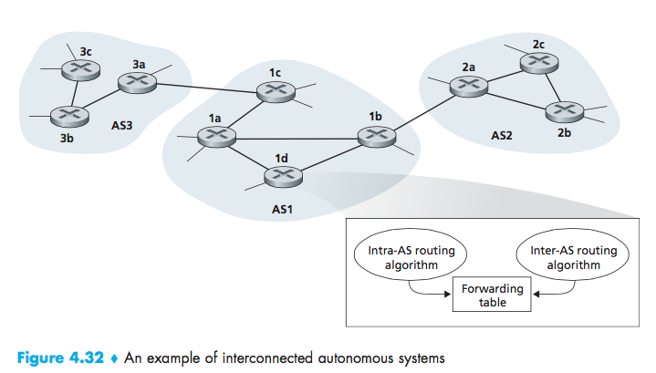
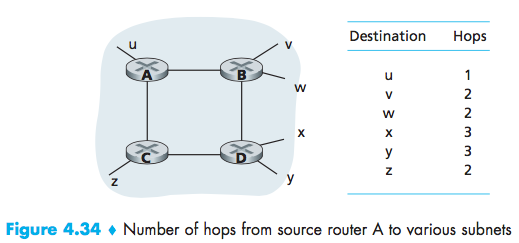
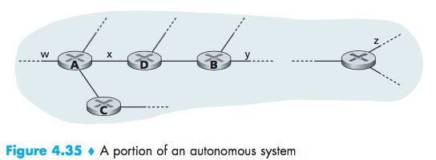
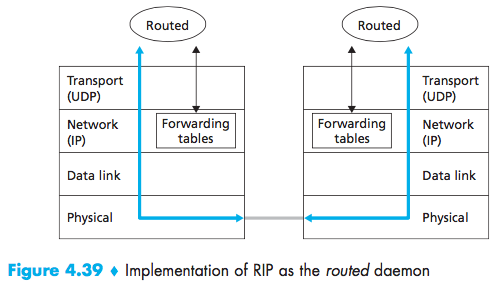

# Lecture 14 #
### Hierarchical Routing (4.5.3) ###

Internal destination $\leftrightarrow$ forwarding table $\leftrightarrow$ external destination

Autonomous Systems(AS)
Same AS run the same protocol (intra AS routing protocol)

Examples: AS1 wants to send a datagram outside AS1.

AS1 must learn destination reachable
through AS2
through AS3

propagate this reachability info in AS1

Inter Autonomous System Routing Protocol

- Suppose AS1 learns subnet X reachable through AS3 (not AS2)
Inter AS protocol propagates reachability info to all internal routers.
1-d determines from intra-AS routing info that $l$ is least cost path to 1c $(x,l)$

Example 2: Now subnet x is reachable from AS3 and AS2.

1. Inter-AS: subnet x is reachable via multiple gateways
2. Cost of least-cost path to each of the gateways
3. Choose gateway that has smallest cost
4. $(x, l)$

Routing Protocol
Routing Information Protocol RIP
Intra Routing Protocol [RFC 1058]

- include BSD-Unix
- Distance Vector Algorithm
- Distance metric
- Unix deamon routed

(# hops each link has cost 1; limit: 15 hops)

DVs exchange with neighbors every 30 seconds (advertisement). Source router to destination subnet

**routing table for router D:**
| destination subnet | next router | hops |
|:-:|:-:|:-:|
| W | A | 2 |
| Y | B | 2 |
| Z | B | 7 |
| X | - | 1 |

**from router A:**
| destination subnet | next router | hops |
|:-:|:-:|:-:|
| Z | C | 4 |
| W | - | 1 |
| X | - | 1 |

**routing table after receiving advertisement from A:**
| destination subnet | next router | hops |
|:-:|:-:|:-:|
| W | A | 2 |
| Y | B | 2 |
| Z | A | 5 |

Implementation details:
- If not heard for 180 seconds, neighbors/links declare dead.
- uses UDP protocol:
- modify table, send advertisement to neighbors

Open Shortest Path First (OSPF) [RFC2328]
- open (publicly available)
- uses link state algorithm (Dijkstra)
- map at each node
- route Dijkstra
- link state packet dissemination

weights: 1 per each hop, inversely proportional to link capacity (in order to avoid weak links).

**Upper tier**
_advanced features:_
- Allows multiple paths
- Multiple cost metrics
example: satellite
- best effort (low)
- real-time (high)
- authentication (security)
- multicast support
