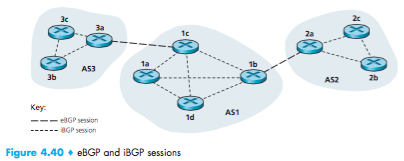
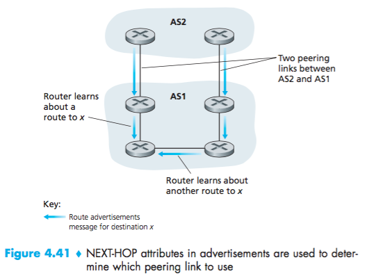
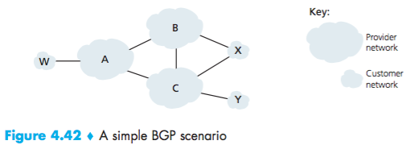

# Lecture 15 #

Intra AS Routing Protocol

- RIP (Distance Vector)
- OSPF (Link State [Dijkstra, map of the network])

Hierarchical OSPF

<!--this picture should have a linear network on the right. check phone picture-->

Two level hierarchy:

- link state only in 2a:
each area node has detailed area topology, only knows shortest paths to nodes in other areas.

- area border routes "summarize" distance to nodes in own area, advertise to other area border routers.

- backbone routers: run OSPF limited to backbone.

**Inter-AS routing:**

_BGP (Border Gateway Protocol):_
- Inter domain routing protocol
- It glues the Internet together

BGP provides toto Autonomous Systems (AS):
- eBGP (external): subnet-reachability
information from neighboring AS System

- iBGP (internal): propagates reachability info to all AS internal nodes

If we follow path:

$$3a\rightarrow1c\dashrightarrow1b\rightarrow2a$$

BGP steps:

1. Send a prefix 138.16.67.0/24 (might send one or a collection of networks). AS3 will forward datagrams/24 towards that prefix. Can aggregate multiple prefixes.
2. AS1 uses iBGP to distribute the new prefix to all routers.
3. eBGP reachability info from AS3 to AS2.
4. When a router learns of a new prefix, it creates a new entry in the forwarding table.

BGP session: two BGP routers ("peers") exchange BGP messages over TCP.

BGP messages: prefix and attributes.

attribute: AS-PATH AS System through which prefix advertisement has passed.

_example:_
$AS2 \rightarrow AS1 \rightarrow AS3$

`AS-PATH = AS2 AS1`

Next-hop: router IP address of the interface that begins the AS-PATH:

Two peering links between AS2 and AS1

If both have same AS-PATH, least amount of hops could be a way to reach destination, but internal routing ultimately decides it.

x is dual homed
$B\rightarrow x$
Would X want to route from B via C?
No.
- X will not advertise to B a route to C. (Market competition rules).

- $A$ advertises path $\vec{AW}\rightarrow B$
- $B$ advertises path $\vec{BAW}\rightarrow X$

Should $B$ advertise path $BAW$ to $C$?

- NO! B gets no "revenue" from routing $\vec{CBAW}$ neither W nor y are B's customers.
- B wants to force C to route W via A
- B wants to route only to its own customers.

Differences between Intra, Inter, AS Routing:
- policy: Inter AS admin wants control over how its traffic is routed. Inter-AS: single admin, no policies.

- performance: Intra-AS can focus on performance. Inter-AS policy over performance.
