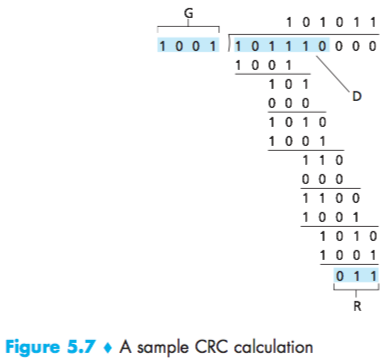

# Lecture 16 #

HW3 due march 22 (Tuesday)
Extra office hours: tuesday 3:00 - 5:00pm
midterm wed 23 (march 5:00pm - 6:15pm)

### Link Layer ###

```
                 ├── host1
router──router───│   
                 └── host2
```
- each link is one hop
- multiple access: multiple users will be sharing a wire of RF
- framing: bit patterns at the beginning/end of the frame
- flow control
- error detection/correction
- reliable delivery

```bash
T ────────────────── R
simplex: transmit or receive (e.g. TV)
```

```bash
T | R ────────────────────── T | R
Full-duplex: transmit and receive simultaneously e.g. telephone
```

```bash
Half-duplex: transmit and receive alternatively (e.g. police radio)
```

#### Error detection: ####

parity: `1 011 1 0100`
odd parity: `0 01110100` (single error bit)
even parity: `0 01 0 10100`

even parity should work the same, not capable of detecting 2-bit errors.

Two dimensional parity:
even parity:

```bash
addition to get 0, vertically and horizontally:

10101| 1
11110| 0
01110| 1
─────└────
00101| 0
```

```bash
10101| 1
10110| 0
01110| 1
─────└────
00101| 0
```

#### Cyclic Redundant Check (CRC) ####

**Example: make number divisible by 9:**
Check digit method:
you want to send 823
1. left shit: 8230
2. divide by 9, remainder of 4
3. subtract remainder from 9 - 4 = 5
4. add the result of step 1 and step 3: 8235

if the other side gets 7235, not divisible by 9. (therefore, there is a single digit error).

also able to detect several multiple digit errors (not all of them, but most of them).

**Module 2-arithmetic:**
```bash
(addition)
1111
1010 +
────
0101


(subtraction)
1001
1101 -
─────
0100


(multiplication)
  1101
    11 *
 ─────
 11001
11001
──────
101011

(division)
___110__
11|1010
   11
   ─────
    11
    11
   ─────
     00
```

CRC (5.2.3; p.443)
Binary check digit method (mod 2)
$D = 101110$ $d = 6$
$6 = 1001$   $r = 3$
             $r + 1 = 4 bits$
             $r = 32 bits$
             $r + 1 = 33$

1. Left shift $D$ by $r$ bits $D \cdot2^r = 101110000$
2. Divide $D \cdot2^r$ by $6$, find the remainder (fig. 5.7)
$R = 011$
3. Subtract remainder from 6 (not required in mod 2)
4. Add the result of step 1 and 2.
$T = 101110011$


