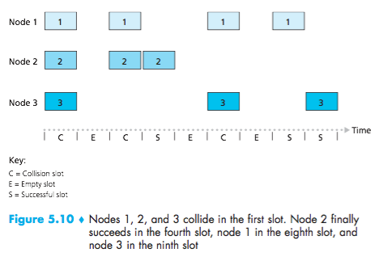
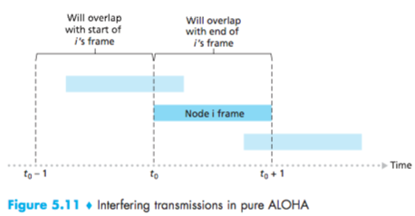

# Lecture 17 #

Multiple Access:

- point-to-point link
- broadcast (shave wire)
  - old ethernet
  - 802n wireless LAN (share)

- How to coordinate the access
- Sending and receiving nodes

### Three approaches ###

_Multiple access protocol:_

- channel partitioning (ex: TDM, FDM)
- random access protocols (when a node has a packet to send to a shared broadcast channel)
- taking turns

#### Slotted Aloha ####

_Assumptions:_

- frames have equal size
- time divided into equal size slots (time to send a frame)
- nodes transmit only at slot beginning
- nodes are synchronized
- If 2 or more nodes transmit in the same slot, all nodes detect collision

Operation:

- node has a new frame, transmits in the next slot
- no collision, node can send the new frame
- if collision: node transmit the frame in each subsequent slot, with probability p until success.

probability of success: $p(1-p)^{n-1}$

#### Unslotted Aloha ####
- no synchronization
- when the frame arrives, transmit

#### CSM: carrier sense multiple access ####
- Listen before you transmit
- IEEE 802.3 CSMA/CD (collision detection)

- if the medium is idle, transmit
- if medium is busy, wait until idle, then transmit immediately

If a collision is detected while transmitting
- transmit a jam (high voltage) signal for one slot (51.2$\mu$s, 64 bytes)
- wait for a random time and reattempt

collision detected by monitoring the voltage:
high voltage $\rightarrow$ two or more transmitters (collision)

1. Channel partitioning (TDM, FDM)
2. Random Access (Aloha, unslotted Aloha, CSMA/CD)
3. Taking Turns

- Token Passing
(control token passed sequentially) one node goes down, single point of failure. Starvation is also a problem.

### MAC Address ###
48bit
6 bytes = 80:01:43:00:80:0C

80:01:43: organization unique identifier
00:80:0C (assigned by OUI)

Broadcast will be FF:FF:FF:FF:FF:FF
Given an IP address, find the MAC address.

ARP (address resolution protocol)
What is the MAC Address of 127.131.115.100?
FF:FF:FF:FF:FF:FF
The MAC Address for 127.123.115.100 is: ...

LAN: Single Broadcast domain
- no routing between members of LAN
- no need for IP

Ethernet:
- dominant technology
- inexpensive (NIC are cheap)
- kept with speed

bus (collisions) star (no collisions)

Frame Structure

(picture)

7 bytes with pattern 10 101010
Followed by one byte 10101011
