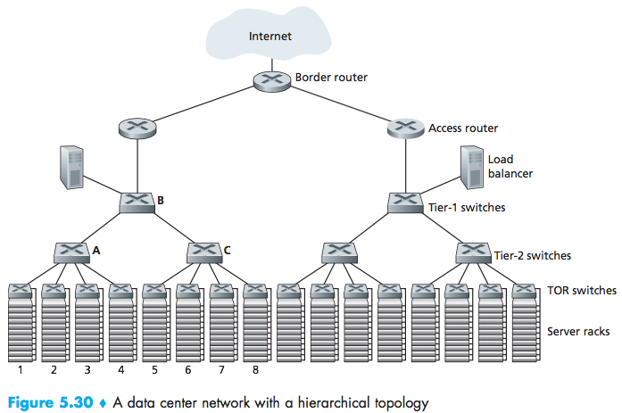
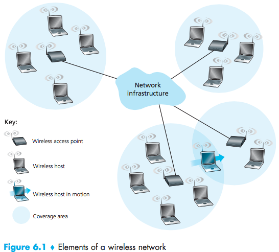
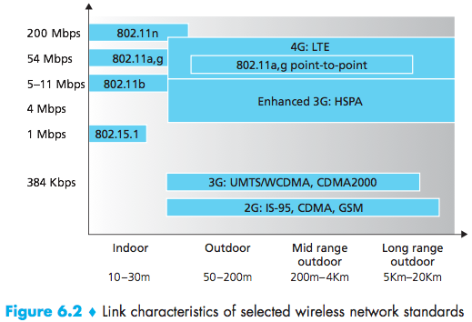
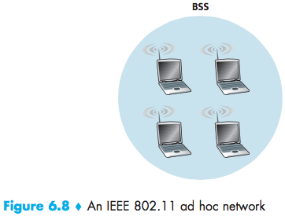

# Netcentric Lecutre 18 #

Ethernet:

- no handshakes between sending and receiving (connectionless) NICS (network interface cards)
- unreliable: receiving NIC does not send any ACKs

_What happens with dropped frames?_

> only recovered reliable data transmission (e.g. TCP) otherwise lost.

Ethernet Switch:
- Link Layer Device
- Transparent (host-to-host)

Functions: filtering (drop or not), forwarding

Use a switchable Address interface:

| Address | Interface | Time |
| :------ | :-------- | :--- |
|`62-FE-F7-11-89-A3`|1| 9:32 |
(time meaning when was the entry placed in the table)

A new frame arrives with destination address `DD-DD-DD-DD-DD-DD` on interface   

- No entry for `DD-..` switch forward to all interfaces. $\rightarrow$ broadcast it
- There is an entry `DD-DD-DD...` in table `X`. $\rightarrow$ discard it
- `DD-DD...:` $y\neq x. \rightarrow$ forward to interface y

Switch self learns.
(one of the nice features of switches)

**Table is built automatically, dynamically and autonomously:**
1. switch table initially empty
2. for each incoming frame, store the source address: - source address - interface - time
3. no frames received in a frame interval (delete the entry)

**Routers vs. Switches**

| Routers       | Switches   |
| :------------ | :--------- |
| IP            | MAC        |
| Network Layer | Link Layer |
(both have tables)

#### Enterprise Networks ####
(data centers)

$10,0000 \approx 100,000$ host
Useful for: Storage, Computation Intensive, Content Delivery

Load-Balancers:
- External Clients Request
- Help direct workload inside data centers
- Return the results to clients

TOR: Top of the Rock switches

## Chapter 6: Wireless Networks ##

- relay (sending packet between host)
- connect to the wired network

_host:_ (might be stationary or mobile) smartphones, laptops, running applications

_base station:_ access point, cell tower.

Infrastructure mode

- base station: connects mobile into wired network
- handoff: mobile changes base station

Ad-hoc mode:
(no base stations)

| | multiple hops | multiple hops |
| :------------- | :------------- | :-- |
| **infra structure**   | host connected to base then interact| |
| **no infra structure**| bluetooth | no base station, no connection to internet, MANET, UANET |

**Wireless Link Characteristics**

- decreased signal strength
- interference from other sources
- multi path propagation: radio signal reflects
