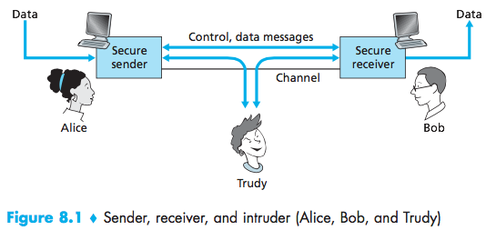
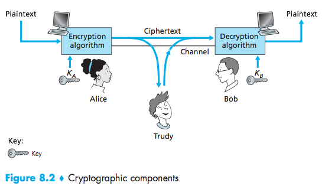

# Network Security #
### chapter 8 ###
04/06/2016

1. Confidentiality and privacy (no snooping or wiretapping)
2. Authentication: you are who you say you are
3. Authorization: Access control, only authorized users get access to the data.
4. Integrity: Received = Sent
5. Availability: legal users should be able to use (no Denial of Service)
6. Non repudiation: neither receiver nor sender can deny message was sent.

Model:

Alice could be:

- electronic commerce (web browsers/server)
- banking
- email
- router exchanging tables

Types of attack:
- eavesdropping
- inserting messages
- playback / impersonation (can fake spoof)
- denial of Service
- hijacking (taking over) ongoing connections

Cryptography:

_Roman Cypher:_
$K = letter+3$
|plain text | a | b | c | d |
|:----------|:- |:- |:- |:- |
|           | $\downarrow$ | $\downarrow$ | $\downarrow$ | $\downarrow$ |
|cypher text| d | e | f | g |

$m=$ Bob, I love you. Alice
$m_{ncrypt}=$ Ere, L oryuhbrx dolfy

25 possible values.

_Mono alphabetic cipher:_

| plain text | a | b | c | d | z |
| :--------- |:- |:- |:- |:- |:- |
|        |$\downarrow$|$\downarrow$|$\downarrow$|$\downarrow$|$\downarrow$|
| cypher text| m | p | b | v | q |

encryption key: mapping from a set of 26 letters to a set of 26 letters.

|a|b|c|
|:-|:-|:-|
|a|b|c|
|a|c|b|
|b|a|c|
|b|c|a|
|c|a|b|
|c|b|a|

$3!=6$ total possibilities.

_Symmetric key encryption:_

Features:

- Bob and Alice share symmetric keys $K_s$
- How do they agree on the key?

Ways to break an encryption scheme:

- Cypher text only attack. Trudy has only cypher text.
- Bruteforce (send over all keys)
- Statistical Analysis (most and least frequent use of letters. prepositions have less letters).

_Known plain text attack:_ Trudy has access to plain text corresponding to cipher text

_Chosen plaintext attack:_ Trudy can get cipher text for a chosen plain text.

> The quick brown fox jumps over the lazy dog.

A more sophisticated approach
- N substitution ciphers: $C_1, C_2, ..., C_n$
- Cyclic pattern:
ex: $n=4$, $C_1, C_3, C_4, C_3, C_2$

$C_1$: $K=5 \rightarrow C_1, C_2, C_2, C_1, C_2$
$C_2$: $K=19$

| plaintext: | Bob, I love you|
| :--------- | :------------- |
| ciphertext:| Ghu, ...       |

_Block Encryption:_
Used in:
PGP (Pretty Good Privacy - secure mail)
SSL: Secure TCP
IPSec (secure network layer)

$K=3$

| $Block_{input}$ | $Block_{output}$ |
| :------------- | :------------- |
|000|010|
|001|111|
|010|000|
|011|110|
|100|100|
|101|101|
|110|011|
|111|101|

$(2^k)!$
$(2^3)!=40230$

We can make the key bigger:

$K=64$
$2^64! \rightarrow$ hard to handle.

We divide the block.

_full block cypher_
<table>
<th colspan="8">64 bit input</th>
<tr>
  <td>8bit</td>
  <td>8bit</td>
  <td>8bit</td>
  <td>8bit</td>
  <td>8bit</td>
  <td>8bit</td>
  <td>8bit</td>
  <td>8bit</td>
</tr>
<tr>
  <td>$\downarrow$</td>
  <td>$\downarrow$</td>
  <td>$\downarrow$</td>
  <td>$\downarrow$</td>
  <td>$\downarrow$</td>
  <td>$\downarrow$</td>
  <td>$\downarrow$</td>
  <td>$\downarrow$</td>
</tr>
<tr>
  <td>T1</td>
  <td>T2</td>
  <td>T3</td>
  <td>T4</td>
  <td>T5</td>
  <td>T6</td>
  <td>T7</td>
  <td>T8</td>
</tr>
<tr>
  <td>$\downarrow$</td>
  <td>$\downarrow$</td>
  <td>$\downarrow$</td>
  <td>$\downarrow$</td>
  <td>$\downarrow$</td>
  <td>$\downarrow$</td>
  <td>$\downarrow$</td>
  <td>$\downarrow$</td>
</tr>
<tr>
  <td>8bit</td>
  <td>8bit</td>
  <td>8bit</td>
  <td>8bit</td>
  <td>8bit</td>
  <td>8bit</td>
  <td>8bit</td>
  <td>8bit</td>
</tr>
<tr><td colspan="8">Row 3 Cell 1</td></tr>
</table>

Transformation:
substitution replace k-bit input blocks with k-bit output blocks
permutation, move input bits around
$1\rightarrow 13$, $2\rightarrow 61$, electronic
substitution followed by permutation

### DES (Data Encryption Standard) ###
