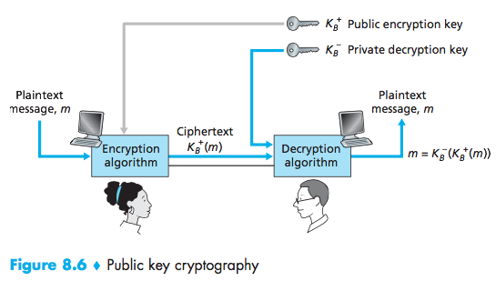

# Lecture 21 #
04/11/2016

#### Symmetric Key Cryptography ####

Block Cipher: DES (Data Encryption Standard)

How it works:

- Initial Permutation
- 16 identical rounds of function application [Feistel function], each using a different 48 bit key.
- - Feistel Function:
- - - expansion
- - - key mixins
- - - substitution
- - - Permutation

Features:
- US encryption Standard
- 56-bit key, 64-bit blocks
- brute force attack: try all possible keys
$2^{56}$ possible keys.

*Triple DES makes it safer* 
Main idea: Encrypt 3 times, with 3 different keys.

*AES: Advanced Encryption Keys:* 

- Blocks 128 bits
- key 128, 192, 256 bits

bruteforce: (try each key)

- 1 second in DES.
- 149 trillion years for AES.

#### Public key Cryptography: ####

Disadvantange of symmetric key:

- it requires sender and receiver to know shared secret key.
- sender and receiver do not share secret key

Public Key encrypts: $K_B^+$ 
Private Key decrypts: $K_B^-$ 

#### RSA ####
R: Ron *R*ivest 
S: Adi *S*hamir 
A: Leonard *A*ddleman 
(2002 Turing Award)

#### Modular Arithmetic ####

example: 
6am + 7 hours 

$(6+7)mod12=1$ 
$13=1mod12$

8am + 25 hours 
$(8+25)mod12=$ 
$33mod12=9$

_addition:_ 
$[(a\mod\ n) + (b\mod\ n)]\ mod\ n$= 
$(a+b)mod\ n$

_subtraction:_ 
$[(a\ mod\ n)-(b\mod\ n)]\ mod\ n=$ 
$(a-b)mod\ n$

_multiplication:_ 
$[(a\ mod\ n)*(b\mod\ n)]\ mod\ n=$ 
$(a*b)mod\ n$

_example:_ 
$(5\cdot4)mod\ 3=$ 
$20mod\ 3 = 2$

$[(5mod\ 3)\cdot(4mod\ 3)]mod\ 3$ 
$(2\cdot1)mod\ 3$

but if $a=b$, for multiplication we get: 
$[(amod\ n)^d]mod\ n=a^dmod\ n$ 
$a = 14$ 
$n = 10$ 
$d = 2$ 

$[14mod\ 10]^2mod\ 10=14^2mod\ 10$ 
$4^2mod\ 10 = 196mod\ 10$ 
$6=6$ 

#### RSA preliminaries ####
- mesage: just a bit pattern
- bit pattern can be uniquely represented by an integer
- therefore, encrypting a message is equivalent to encrypt a number

example: $m=10010001$. This message is uniquely represented by 145.

Components:
1) Creating the public key and private key 
2) THe encryption and decryption algorithm 

**Creating Public/Private Key:**

1. Choose a large prime number (p, q), (eg: 1024)
2. Compute $n=p\cdot q$, $Z=(p-1)(q-1)$
3. Choose $e$ (with $e$ < $n$) with no common factors with $z$. $E, Z$ relative prime.
4. Choose $d$ such that $ed-1$ is exactly divisible by $z$. $ed\ mod\ z=1$
5. public key: $(n, e) [K_B^+]$ 
private key: $(n, d) [K_B^-]$ 

example: 
$p=5$, $q=7$, e=5 
$n=35$, $z=24$, d=29 

$e\cdot d-1$ is divisible by 24. 
$145-1=144$

$K_B^+:(35, 5)$ 
$K_B^-:(35, 29)$ 

_To encrypt:_ 
Alice wants to send Bob a bit pattern represented by m $(m < n)$

$c = m^e\ mod\ n$

message: "love"
(l is the $12^{th}$ letter of the alphabet)

| plaintext|m|$m^e$|c|
|:-------  |:-|:-|:-|
|l|12|248832|17|
|o|15|...|...|
|v|22|...|...|
|e|5|3125|10|

_To decrypt:_ 

$m=c^d\ mod\ n$

|c|$c^d$|$c^d\ mod\ 35$|
|:-|:-|:-|
|10|$10^{29}$|$10^{29}\ mod\ 35=5$|
(table 8.3)

_Math Fact:_ 
for any $x$ and $y$ 
$x^y\ mod\ n=x^{y\ mod\ z}\ mod\ n$ 
where $n=p\cdot q$ and $z=(p-1)(q-1)$

_To show that it works we must show that:_ 
$c^d\ mod\ n=m$ 
where $c=m^e\ mod\ n$ (encrypted message) 
($m^e\ mod\ n)^d\ mod\ n$ 
$m^{e-d}\ mod\ n$ 
$m^{ed\ mod\ z}\cdot\ mod\ n$

$ed\ mod\ z = 1$ (as stated before) 

$m^1\cdot\ mod\ n$ 
$m\ mod\ n = 1$ (as stated before) 
$m = m$
