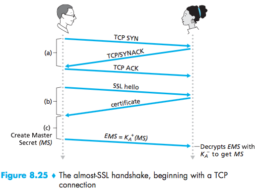

# Lecture 22 #

RSA:
$K_B^-(K_B^+(m))=m=K_B^+(K_B^-(n))$

Why is RSA secure:

If you have public key $(n,e)$, how hard is it to determine private key $(n,d)$?

If I know $p$ and $q$, $n=p\cdot q$ need to compute $z=(p-1)(q-1)$

In order to compute $d$ I need to find the factors of $n$ $(p,q)$

- This uses the difficulty of factoring integers
- It cannot be done in polynomial time XO ($b^c$)

RSA number: 768 bits
- 1500 CPU years to factor.
- 2 real years in a lot of computers (parallel processing)

RSA typically uses 1024, 2048, and 4096 bits.

RSA in practice

_public encryption:_
- Exponentiations in RSA is computationally expensive.

_symmetric encryption:_
- DES, 3DES, AES, etc, is at least 100 times faster than RSA.

We use the RSA (public key) cryptography to establish the secure connection, then establish a second key (symmetric session key) for data encryption.

Session Keys, $K_S$

- Bob and Alice use RSA to exchange the symmetric key $K_S$
- Once both have $K_S$, they use symmetric key cryptography.

RSA is used to send the symmetric key.

Authentication:
Bob wants Alice to confirm her identity.

1. First option:

The person sending the message “I am Alice” is indeed Alice. For example, Trudy (the intruder) could just as well send such a message.

2. Second Option:

Same issue.

3. Third option:

Vulnerable to playback attacks. Use the same message at a later time.

4. Fourth option:

Works but you need to exchange keys safely beforehand.

5. Fifth Option

We could still have a Man in the Middle Attack if Trudy stands right in between the connection. Trudy won't hinder communication, but will stand in between the connection playing both roles.

Digital Signatures:

- A cryptography technique similar (analogous) to a written signature
- Bob digitally sends the document establishing he is the document owner/creator.
- Verifiable
