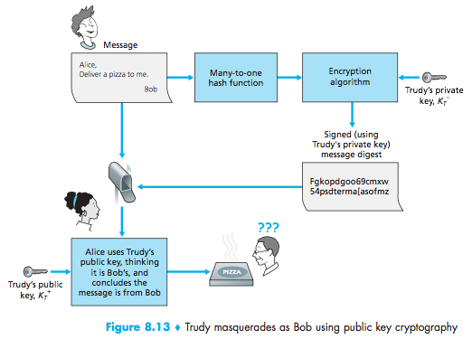
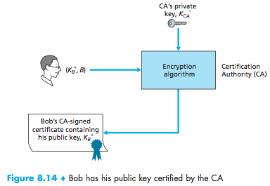
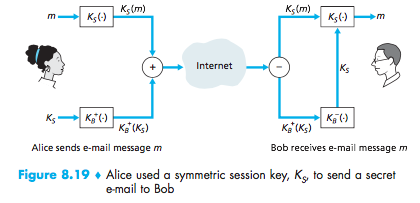
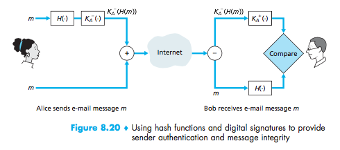
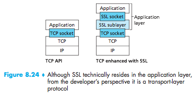
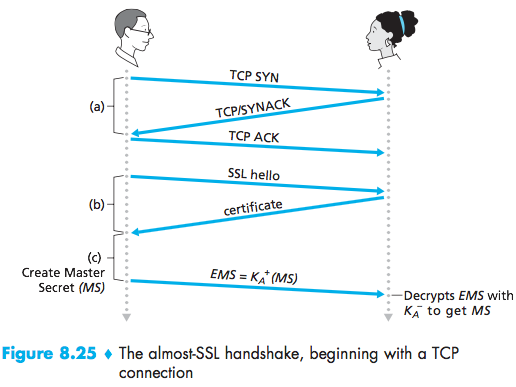

# Lecture 23 #

Digital Signatures

Use a message digest computiationally expensive to public-key encrypt large
messages

- Many to 1
- Produces a fixed size message digest
- Given message digest x, x=H(m). It should be infeasible to find m

Send:

- hashing message pic -

- public key certification pic -

Hash Function Algorithms:

- MD5 (RFC 1321) 128 bit message digest
- SHA-1 US Standard (RFC 3174), 160 bit message digest

Important fact:

For public key cryptography to be used, you need to verify that you have the
actual public key of the entity: person, router or browser.

whom you want to establish communications

Alice needs to verify that
key that is supposed to be Bob's is really Bob's

Certification Authorities

CA: bind a particular key to a particular entity, E

- E (person, router) will register its public key CA
- E provides "proof of entity" to CA
- CA creates a certificate binding E, to its public key
- Certificate containing E's public key is digitally signed by CA. CA says
"This is E's public key"

When Alice wants Bob's public key

- Get Bob's certificate from CA
- Apply CA's public key to Bob's certificate to get Bob's public key

Secure Email:
Alice wants to send a confidential email to Bob

SSL (Secure Socket Layer):
- wildly deployed security protocol
- supported by almost all browser, web servers, etc
- billions of $ over SSL yearly

`Bob-->public_internet-->alice's_shop`

Bob fills a form, buys some perfume, input credit card, expect charge.

- no confidentiality (encryption):
people can get the payment info (credit card)
- authentication: Trudy can pretend to be Alice (take money and credit card number)
- Data integrity: Trudy can modify Bob's order by 10x.

SSL resides in Application Layer.

From a developer perspective is a transport layer protocol
- Java, C, python libraries.

1. Handshake:

