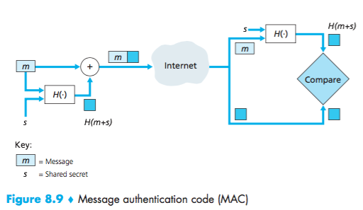
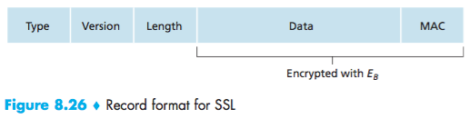
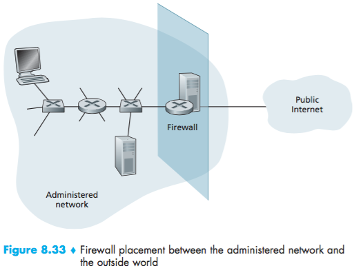
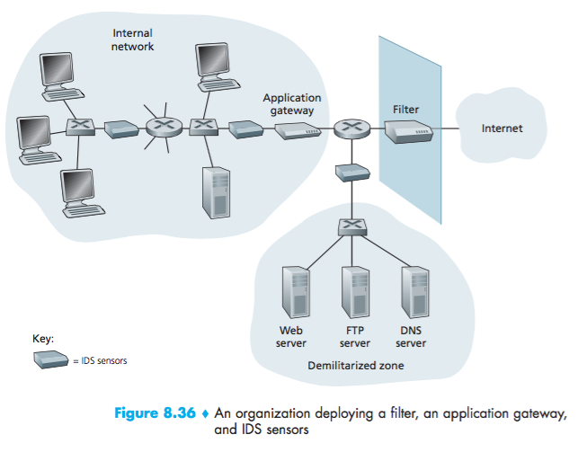

# Lecture 24 #

04/21/2016

### SSL ###

1. Handshake

- pic -

Considered bad to use same key for more than one operation.

- use different keys for message authentication codes (MAC) and encryption.

2. Key Derivation

KOF key derivation function, MS+random data

$E_B=$Encryption key data sent from Bob to Alice

$M_B=$MAC key for data sent from Bob to Alice

$E_A=$encryption key for data from Alice to Bob

$M_A=$MAC key for data sent from Alice to Bob

3. Data Transfer

- where to put the MAC.
If we put it at the end, no integrity until all data is processed (e.g. instant messages).

Instead, break the stream in a series of records

- each record carries a MAC
- receiver can act on each record as it arrives

Bob uses $E_B$ to encrypt the whole package, then pass to TCP.

### Possible Attacks ###

Trudy can execute a woman in the middle attack.
She can insert, delete, replace segments in TCP.

In SSL:
Alice will decrypt, check MA to verify integrity; pass decrypted to the Application layer, but they are not in the correct Order.

Solution: Put a segment number into the MA
MAC = H(Mb, data, sequence)

Alice tracks Bob's sequence number, verify data integrity with the number.

Truncation:

- Attackers foregoes TCP connection close segment
- One or both parties thinks there is less data

Solution: record types:
type0: data
type1: closeup

| encrypt | type | data | MAC |
|:------- |:---- |:---- |:--- |

Example:

Common SSL symmetric ciphers:
- 3DES, other block ciphers; SSL public encryption RSA.

#### Summary Network Security ####

Basics:

- symmetric and public key Cryptography
- message integrity
- end-point authentication

Used in:

- secure email
- secure transport layer (SSL)
- secure network IP Sec, VPN
- security at link layer 802.11

---

## 8.9 Operational Security ##

Firewalls:

Administered Network (trusted, good guys)
Public Internet (bad guys)

Isolates organization internet net from larger Internet, allowing some packets to pass while blocking others.

ex:

- prevent denial of service
- prevent illegal modification / access of internal data
- allow only authorized access to inside the network
- censor the Chinese internet (great firewall of China)

### Type 1: Stateless packet filtering ###

- internal network connected to internet via router firewall
- filters packet-by-packet, decision to forward/drop based on:
- - source IP, destination IP
- - TCP/UDP source and destination port numbers
- - ICMP message Type
Firewall setting
ex. 1 Drop all outgoing packets to any IP, port 80. (no outside web access)
ex. 2 Drop all UDP outgoing packets except DNS. (prevent using call available bandwidth)

### Type 2: Stateful ###

Track status of every TCP connection.
Track Connection setup, (SYN), teardown

Determine whether incoming, outgoing packets make sense.

### Type 3: Application Gateways ###

Filter application data, as well as IP/TCP/UDP
example: allow select internal users to telnet outside

- All telnet users should use gateway server
- relay
