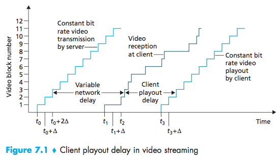
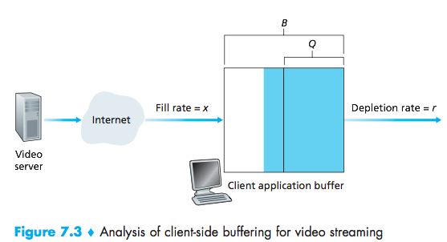
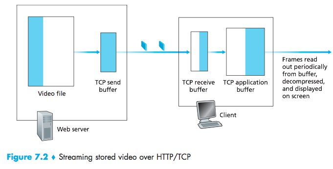
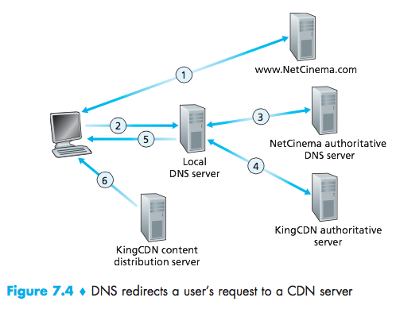

# Lecture 26 #
04/28/2016

### Multimedia Networks ###

Video: Sequence of images displayed at constant rate
ex: 24 images/sec

- digital image: array of pixels. (BMP)
- coding users redundancy

spatial redundancy, temporal redundancy.
Instead of sending all the frames of a video, it is possible to send a key frame and send the $\triangle$ of the following frame to optimize (assuming frames are similar).

Types of application

- streaming stored audio/video: can begin playback before downloading in detail.
- videos stored in the server will be reopen in the client
- voice over IP
- streaming live

applications such as: youtube, hulu, netflix, spotify

UDP Streaming
HTTP Streaming
Adaptive HTTP Streaming

1. video recorded
2. video sent
3. video received played out at client.

client plays video while server still pending other parts.

- challenges: continuous playback constraint:
- when client begins, play must match original timing.
- network delays are variable.

- buffering and playout delay
- fill the buffer until playout begins
- buffer levels change overtime, rate x(t) varies. r is constant.

$\bar{x}$ average fill rate, playout rate $r$
$\bar{x}<r$ buffer empties, video freezes
$\bar{x}>r$ buffer will not empty out provided initial playout delay is large enough to absorb variability in x(t)
tradeoff: starvation, less likely with large delay, user might be impatient.

**UDP streaming**
- server sends a rate appropriate for client.
- send rate = encoding rate = constant
- problems: oblivious to congestion levels
- recovery at the application level
- RTP real time transport protocol [RFC 2326]

UDP can be blocked by firewalls
Streaming multimedia:

fill rate fluctuates due to TCP congestion.
- large playout delay and retransmission
- HTTP/TCP goes through firewalls (mostly)

**Protocols:**
_DASH_  (youtube)
**D**ynamic **A**daptive **S**treaming over **H**TTP

- Server:
divide video into multiple chunks,
each chunk stored and encoded at different rates
manifestfile: provided URL for different chunks

- Client: periodically measures server-to-client bandwidth:
using manifest, request one chunk at a time
chooses maximum coding rate for given current bandwidth
can choose different coding rates at different points

**Content Distribution Networks**
Main challenge: stream content (out of millions of videos) to thousands of users (e.g. youtube)

Alternative 1: Single based data center.
- single point of failure
- geolocation issues (users further away would always have a bad service)
- same video would be downloaded several times
- point network congestion

Alternative 2: Store/Stream copies of videos at multiple geographically distributed locations (Content Delivery Network)
CDN: can be private: (google for youtube)
third party: (akamai for netflix)

The CDN will send the correct address to the user.
The user will use the address to fetch the information. In this scenario the CDN is determine the best server for the user.

CDN Cluster Selection Criteria:
- server geographically closer
- shortest delay (shortest number of hops)
- least congestion

alternatively, client can decide by pinging all of them and choosing the best one.

Netflix:
37% of down Stream:

akamai
limelight
level 3
