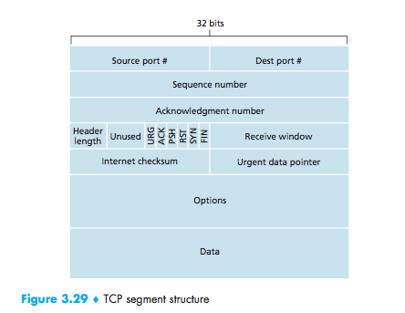
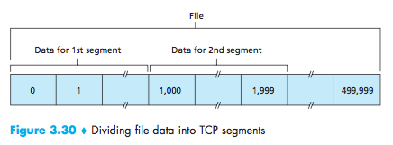
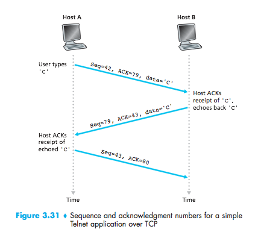
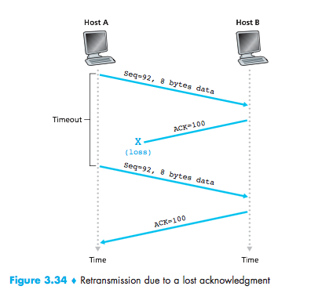
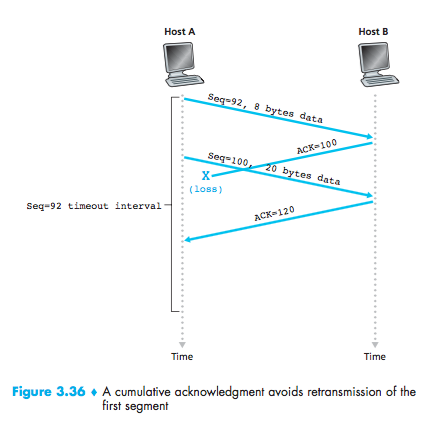

# Lecture 8 #
feb 08/2016

_UDP_

- no  hand shaking between sender and receiver
- each UDP segment handle independently of others
- uses: multimedia
- reliability can be adopted at the app layer
- unreliable, unordered
- IP extension

_TCP_
- reliable/in order
- congestion control
- flow control
- connection setup

No delay guarantees (bandwidth guarantees) for either.

UDP Segment Header: (32 bits)
|source port|destination port|
|:---------:|----------------|
|length     |checksum        |
|DATA       |                |

Data should span across

_Checksum:_
`a. 0110 0110 0110 0000`
`b. 0101 0101 0101 0101`
`c. 1000 1111 0000 1100`

where a, b, and c are: the source port, dest. port, length and payload (not the checksum).

`a + b = 1011 1011 1011 0101`

`[(a + b) + c] = 0100 1010 1100 0001`
`with the overflow = 0100 1010 1100 0010`
`checksum: ~[(a + b) + c] = 1011 0101 0011 1101`

sum the first two, and add the third one.
if there is overflow, wrap it and complement.

Sender:
_Treat segment as 16 integers_
- addition of segment content
- put checksum value into UDP field

Receiver:
- Compute checksum
- Compare with the one found
- No: error detected
- Yes: no error detected but there might still be errors

UDP segment header:
_32 bits_:
<table>
  <tr>
    <td>source port</td>
    <td>destination port</td>
  </tr>
  <tr>
    <td>length</td>
    <td>checksum</td>
  </tr>
  <tr>
  <td colspan="2" style="text-align:center;">Data</td>
  </tr>
</table>

connection established:
RST, SYN, FIN, ACK, PHS
push data to layer above
URG
urgent data (p. 261)

Segment size:

Sequence number: byte stream "number" of first byte in segment's data byte in segment's data

Maximum Segment Size (MSS): 1000 bytes, 500 segments.

ACK number: sequence number of the next byte expected from the other side.

_Timeout retransmit mechanism_
How to set the TCP timeout value?

too short: unnecessary retransmissions, (premature timeout)
too long: slow reaction to segment loss.

How to get TCP time out value:

Estimated round trip time (RTT):
$(1-\alpha)EstimateRTT+\alpha\,SampleRTT$
$\alpha=0.10$
$\alpha=0.15$

$DeviationRTT=(1-\beta)*DeviationRTT+\frac{\beta}{senderRTT}-EstimatedRTT$

$timeout=EstimatedRTT+4DeviationRTT$

Lost ACK:

Cumulative ACK:

*2 more drawings*

next class:

3.5.4
3.5.5 (flow control)
3.5.6 (connection established)
3.7 (congestion control)
