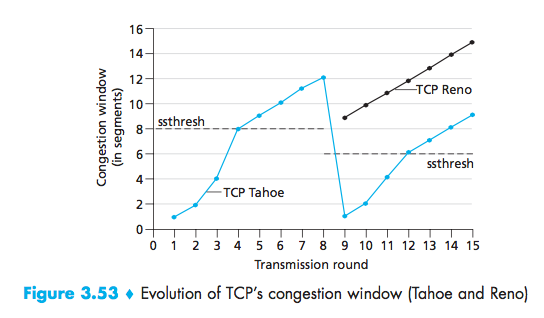

# Netcentric Lecture 8 #
feb 10/2016

TCP

- reliable data transmission
- flow control
- congestion control

From last class:

- lost ACK
- premature timeout
- cumulative ACK

TCP Sender (simplified, no flow control, no congestion control)

- nextseqnum = initial seqnum
- sendbase = initial seqnum

**3 states:**

ACK received:

- ACK valued y
- Send base = y
- sendbase-1 last cumulative ack byte

Data Received from app:
- create segment
- segnumber = next seqnumpass segment to IP (send it)
- nextsegnum = nextsegnumlength (data)
- start timer

Timeout:
- retransmit not yet ACK'd segment with smallest seq number
- start time

TCP Fast retransmit
After sender receives triple ACK duplicate, resend unacked segment with the smallest sequence number.

**Flow control:**

|Application|
|:-:|
|TCP Socket Receiver Buffer|
|TCP Code|
|IP Code|

(direction) $\uparrow$

Problem: Application may remove data from TCP socket buffers slower than TCP sender is sending.

Solution: Receiver advertises free buffer space by including receiver window in the TCP header of receiver to sender segments.

**Connection Management**

- Agree to establish connection
- Agree on connection parameters

TCP 3-way handshake

_Potential Security Problem_:
SYN Flood Attack: Attackers send a large number of TCPSYN, never completing the connection.

Principles of Congestion Control:
Informally: "Many sources sending too much data too fast for the network to handle"

_Symptons:_

- lost packets (buffer overflow at router)
- long delay (queueing in buffer)

_Solutions:_

1) Network assisted congestion control (routers provide feedback to end system).
2) End-to-End congestion control (no explicit feedback from the network)

_Approached by TCP:_
Congestion inferred from end-system:

- observed loss
- delay

_example:_
Sender increase transmission rate (window size) probing for usable bandwidth until loss occurs (keep track of congestion window, _cwind_)
- increase additive: increase by 1 maximum segment size every RTT until loss detected.
- multiplicative decrease: cut cwind 1s half after loss.

When connection begins, increase exponentially until first loss

loss indicated by timeout:

- cwnd set to 1 max segment size
- then grow exponentially, then grow linearly

loss indicated by 3 duplicate ACK's

- cwnd is cut in half, then grows linearly

slow start threshold = $1/2$ cwnd before the loss event
