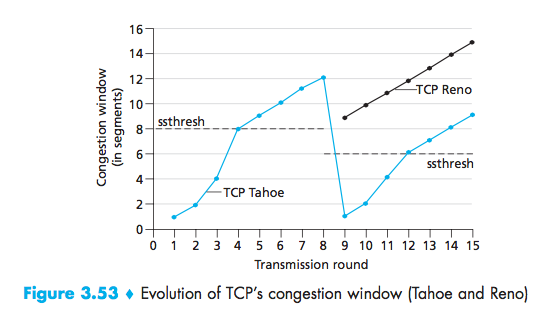
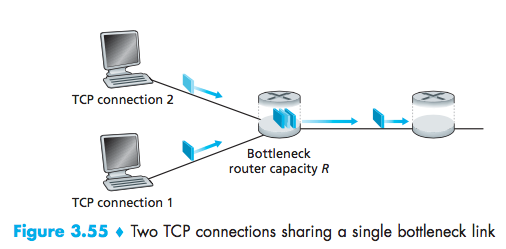
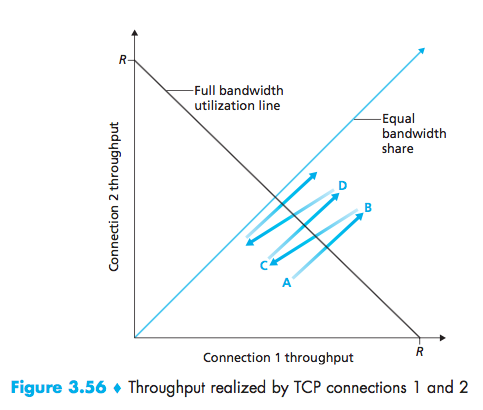
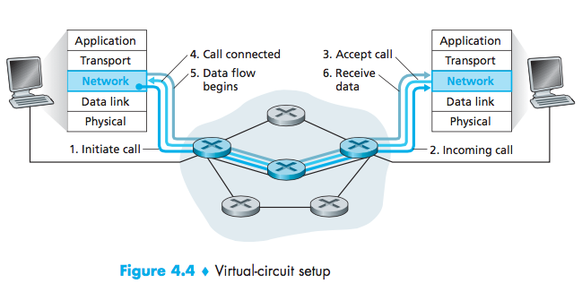

# Lecture 9 #
02/15/2016

Congestion Avoidance (TCP)

Loss indicated by time out

- cwnd goes to 1 MMS
- goes exponentially, then grows linearly

Loss indicated by 3 duplicate ACKs
- (network is capable of delivering some segments)
- cwnd is cut in half, then grows exponentially

Fairness goal: If $K$ TCP sessions $S$ have some bottleneck link $R$, they should have an average rate $\frac{R}{K}$

Apps can open multiple parallel connections between two hosts (web browser)

$R$ has $9$ existing connections

- new app asks for 1 TCP and gets $\frac{R}{10}$
- new app asks for 11 TCPs, gets $\frac{11R}{20}$

### Transport Layer Summary ###

- Multiplexing / Demultiplexing
- UDP / TCP
- Reliable Data Transfer
- Flow Control
- Connection Establishment (3 way handshake)
- Congestion Control

# Chapter 4: Networking (Internet) Layer

Each router $X$ stands for a router.
Each Router implements:

|Network|
|:-:|
|Data|
|Physical|

- Network Layer: protocol in every host and router

- Routers: examine header field in IP datagrams passing through it
