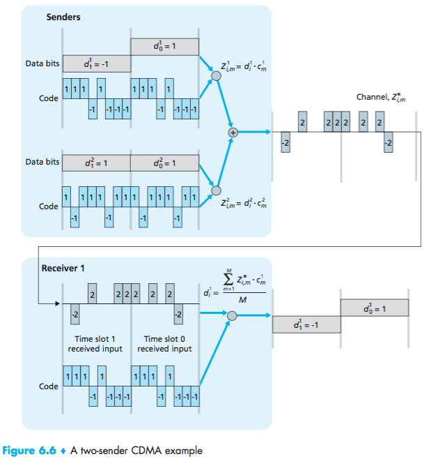
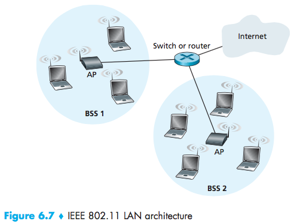
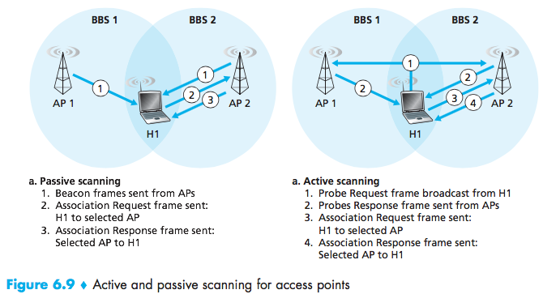
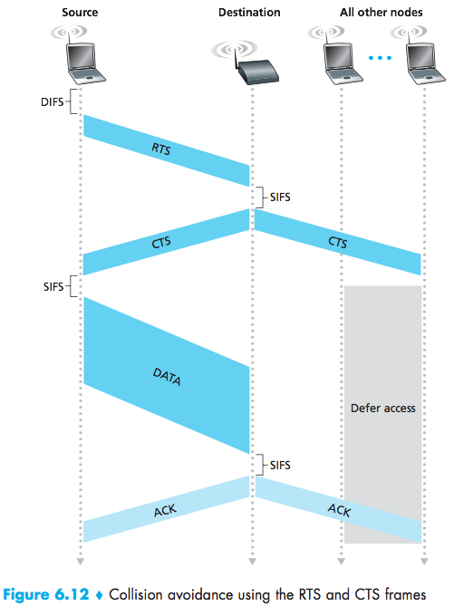
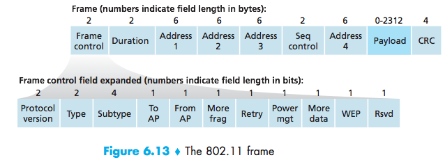
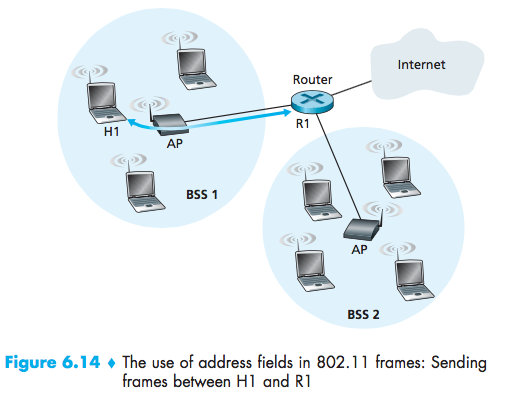

# Wireless vs Ethernet #

6.2 Wireless links and network characteristics

Multiple access:

- Channel Partitioning (TDM, FDM)
- random access
- taking turns

CDMA: code division multiple access

 - unique "code" assigned to each user
 - all users share same frequency but have unique codes
 - multiple users can coexist and transmit simultaneously, with minimal interference. (codes have to be different).

 

 BSS (Basic service set)

 Infrastructure mode: wireless, hosts, access points
 Adhoc mode: hosts only

 | Version| Frequency  | Rate      |
 | :----- | :--------- | :---------|
 | 802.11 | 2.4.6 Ghz  | 1 ~ 2 Mbps|
 | 802.11b| 2.4.6 Ghz  | 11 Mbps   |
 | 802.11g| 2.4.6 Ghz  | 54 Mbps   |

- Some have bass station and adhoc network
- power management

 How to find base stations?
 Passive or Active scanning.

 

 Multiple access:

 **CSMA**
 carrier sense multiple access. Sense before transmitting, do not collide with ongoing transmissions.

 802.11 has no collision detection.
 - difficult to receive (sense)
 - collisions (fading)
 can't sense all collisions (hidden terminal)

 **CSMA/CA:** Collision avoidance.
 

these messages are written in the wireless frame:

Frame Control: 2 bytes (16 bits)
address 1: MAC address of receiver
address 2: MAC address of transmitter
address 3: MAC address of router interface
address 4: adhoc networks
Sequence Control: for reliable data transfer
type: RTS, CTS, ACK, and data.

Power Management:
- node to AP: "I am sleeping until next beacon Frame". (AP knows not to transmit frames to this one).
- node wakes up before next beacon frame.
- beacon frame contains list or mobiles nodes with AP-to-mobile frames waiting to be sent.
- the node will stay awake if AP-to-mobile frames to be sent; otherwise will sleep until next beacon.

Rate Adaptation:

`base station -----> 20meters-----> end point`

high transmission rate, low bit error rate
If the node moves, the base station can change transmission rate. Base stations switch to lower transmission rate, low bit error rate.

Personal Area Networks:
Bluetooth and Zigbee:
- replacement for cables
- $< 10m$ diameter
- adhoc networks
